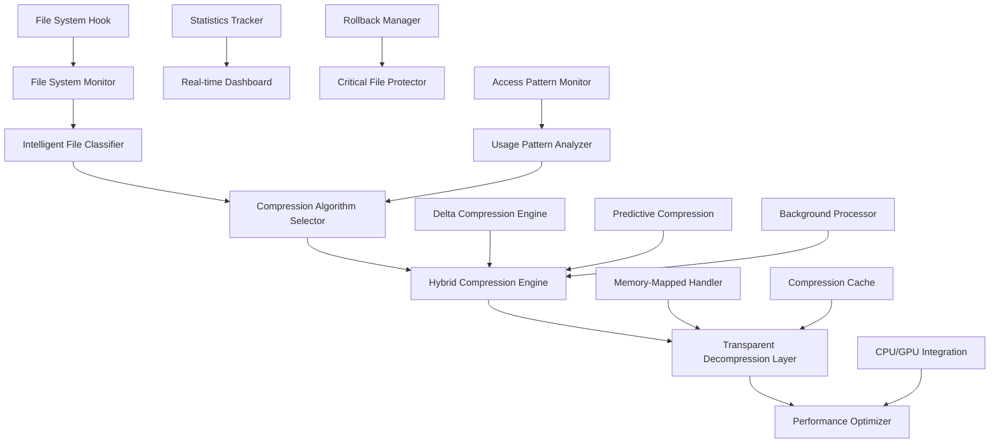

# Advanced Transparent Real-Time Compression System Architecture

## Overview
A sophisticated transparent compression file system that automatically detects, compresses, and decompresses files in real-time with zero user intervention while maintaining full program functionality and achieving maximum storage savings through custom hybrid algorithms.

## Core Architecture



## 1. Transparent Compression File System

### File System Hook Architecture
```csharp
public class TransparentCompressionFileSystem
{
    private readonly IFileSystemHook _fileSystemHook;
    private readonly CompressionEngine _compressionEngine;
    private readonly DecompressionCache _decompressionCache;
    private readonly UsagePatternAnalyzer _usageAnalyzer;
    
    public class FileSystemHook : IDisposable
    {
        private readonly IntPtr _filterHandle;
        private readonly Dictionary<string, CompressionMetadata> _compressedFiles;
        
        // Windows File System Filter Driver Integration
        [DllImport("kernel32.dll", SetLastError = true)]
        private static extern IntPtr CreateFile(string fileName, uint dwDesiredAccess, 
            uint dwShareMode, IntPtr lpSecurityAttributes, uint dwCreationDisposition, 
            uint dwFlagsAndAttributes, IntPtr hTemplateFile);
        
        public async Task<bool> InterceptFileAccess(string filePath, FileAccessType accessType)
        {
            var metadata = await GetCompressionMetadata(filePath);
            
            switch (accessType)
            {
                case FileAccessType.Read:
                    return await HandleFileRead(filePath, metadata);
                case FileAccessType.Write:
                    return await HandleFileWrite(filePath, metadata);
                case FileAccessType.Execute:
                    return await HandleFileExecution(filePath, metadata);
                default:
                    return false;
            }
        }
        
        private async Task<bool> HandleFileRead(string filePath, CompressionMetadata metadata)
        {
            if (metadata?.IsCompressed == true)
            {
                // Transparent decompression
                var decompressed = await _decompressionCache.GetDecompressedFile(filePath);
                if (decompressed != null)
                {
                    // Redirect file access to decompressed version
                    RedirectFileAccess(filePath, decompressed.TempPath);
                    return true;
                }
            }
            return false;
        }
        
        private async Task<bool> HandleFileExecution(string filePath, CompressionMetadata metadata)
        {
            if (metadata?.IsCompressed == true && metadata.CompressionType == CompressionType.ExecutablePacked)
            {
                // For compressed executables, ensure transparent execution
                var executableHandler = new ExecutableDecompressionHandler();
                await executableHandler.PrepareForExecution(filePath, metadata);
                return true;
            }
            return false;
        }
    }
}
```

### Compression Metadata Management
```csharp
public class CompressionMetadata
{
    public string OriginalPath { get; set; }
    public string CompressedPath { get; set; }
    public CompressionType CompressionType { get; set; }
    public string Algorithm { get; set; }
    public long OriginalSize { get; set; }
    public long CompressedSize { get; set; }
    public double CompressionRatio { get; set; }
    public DateTime LastAccessed { get; set; }
    public DateTime LastCompressed { get; set; }
    public int AccessCount { get; set; }
    public bool IsSystemCritical { get; set; }
    public string FileHash { get; set; }
    public List<string> Dependencies { get; set; } = new();
}

public class CompressionMetadataManager
{
    private readonly Dictionary<string, CompressionMetadata> _metadata = new();
    private readonly string _metadataPath = "compression_metadata.sqlite";
    
    public async Task<CompressionMetadata> GetMetadata(string filePath)
    {
        var normalizedPath = Path.GetFullPath(filePath).ToLowerInvariant();
        
        if (_metadata.TryGetValue(normalizedPath, out var cached))
            return cached;
        
        // Load from persistent storage
        var metadata = await LoadMetadataFromDatabase(normalizedPath);
        if (metadata != null)
        {
            _metadata[normalizedPath] = metadata;
        }
        
        return metadata;
    }
    
    public async Task SaveMetadata(CompressionMetadata metadata)
    {
        var normalizedPath = metadata.OriginalPath.ToLowerInvariant();
        _metadata[normalizedPath] = metadata;
        await SaveMetadataToDatabase(metadata);
    }
}
```

## 2. Custom Hybrid Compression Algorithms

### Hybrid Compression Engine
```csharp
public class HybridCompressionEngine
{
    private readonly Dictionary<string, ICompressionAlgorithm> _algorithms;
    private readonly FileTypeClassifier _classifier;
    private readonly CompressionOptimizer _optimizer;
    
    public enum CompressionQuality
    {
        Maximum,        // Maximum compression, slower
        Balanced,       // Good compression, reasonable speed
        Fast,          // Light compression, very fast
        NearLossless,  // Near-lossless for specific file types
        Adaptive       // Adapts based on file characteristics
    }
    
    public class CustomLZMAAlgorithm : ICompressionAlgorithm
    {
        public string Name => "Custom LZMA with Preprocessing";
        
        public async Task<CompressionResult> CompressAsync(Stream input, Stream output, CompressionSettings settings)
        {
            // 1. Analyze input data patterns
            var patterns = await AnalyzeDataPatterns(input);
            
            // 2. Apply preprocessing based on file type
            var preprocessed = await ApplyPreprocessing(input, patterns, settings.FileType);
            
            // 3. Apply custom LZMA with optimized parameters
            var lzmaSettings = OptimizeLZMASettings(patterns);
            var compressed = await ApplyLZMACompression(preprocessed, lzmaSettings);
            
            // 4. Post-process for additional savings
            var final = await ApplyPostProcessing(compressed, patterns);
            
            await final.CopyToAsync(output);
            
            return new CompressionResult
            {
                OriginalSize = input.Length,
                CompressedSize = output.Length,
                CompressionRatio = (double)output.Length / input.Length,
                Algorithm = Name
            };
        }
        
        private async Task<Stream> ApplyPreprocessing(Stream input, DataPatterns patterns, FileType fileType)
        {
            return fileType switch
            {
                FileType.Executable => await PreprocessExecutable(input, patterns),
                FileType.Text => await PreprocessText(input, patterns),
                FileType.Image => await PreprocessImage(input, patterns),
                FileType.Archive => await PreprocessArchive(input, patterns),
                _ => input
            };
        }
        
        private async Task<Stream> PreprocessExecutable(Stream input, DataPatterns patterns)
        {
            // Custom preprocessing for executables
            // - Separate code sections from data sections
            // - Apply different compression to each section
            // - Optimize for common executable patterns
            
            var executable = await PEParser.ParseExecutable(input);
            var preprocessed = new MemoryStream();
            
            // Compress code sections with code-optimized algorithm
            var codeSections = executable.Sections.Where(s => s.IsCode);
            foreach (var section in codeSections)
            {
                var compressed = await CompressCodeSection(section);
                await preprocessed.WriteAsync(compressed);
            }
            
            // Compress data sections with data-optimized algorithm
            var dataSections = executable.Sections.Where(s => s.IsData);
            foreach (var section in dataSections)
            {
                var compressed = await CompressDataSection(section);
                await preprocessed.WriteAsync(compressed);
            }
            
            preprocessed.Position = 0;
            return preprocessed;
        }
    }
    
    public class NearLosslessImageAlgorithm : ICompressionAlgorithm
    {
        public string Name => "Near-Lossless Image Compression";
        
        public async Task<CompressionResult> CompressAsync(Stream input, Stream output, CompressionSettings settings)
        {
            var imageFormat = await DetectImageFormat(input);
            
            return imageFormat switch
            {
                ImageFormat.PNG => await CompressPNGNearLossless(input, output, settings),
                ImageFormat.JPEG => await CompressJPEGNearLossless(input, output, settings),
                ImageFormat.BMP => await CompressBMPNearLossless(input, output, settings),
                _ => await CompressGenericImage(input, output, settings)
            };
        }
        
        private async Task<CompressionResult> CompressPNGNearLossless(Stream input, Stream output, CompressionSettings settings)
        {
            // Advanced PNG optimization
            // - Palette optimization
            // - Chunk reduction
            // - Near-lossless color reduction if enabled
            // - Advanced filtering
            
            using var image = Image.Load(input);
            
            var options = new PngEncoder
            {
                CompressionLevel = PngCompressionLevel.BestCompression,
                ColorType = OptimizePNGColorType(image),
                BitDepth = OptimizePNGBitDepth(image)
            };
            
            // Apply near-lossless optimizations if quality allows
            if (settings.Quality < 100)
            {
                image = await ApplyNearLosslessOptimization(image, settings.Quality);
            }
            
            await image.SaveAsync(output, options);
            
            return new CompressionResult
            {
                OriginalSize = input.Length,
                CompressedSize = output.Length,
                CompressionRatio = (double)output.Length / input.Length,
                Algorithm = Name,
                QualityLoss = settings.Quality < 100 ? (100 - settings.Quality) / 100.0 : 0.0
            };
        }
    }
    
    public class DeltaCompressionAlgorithm : ICompressionAlgorithm
    {
        private readonly Dictionary<string, FileSignature> _similarFiles = new();
        
        public async Task<CompressionResult> CompressAsync(Stream input, Stream output, CompressionSettings settings)
        {
            var inputHash = await CalculateHash(input);
            var similarFile = await FindSimilarFile(inputHash, input.Length);
            
            if (similarFile != null)
            {
                // Use delta compression against similar file
                return await CreateDeltaCompression(input, similarFile, output);
            }
            else
            {
                // No similar file found, use standard compression
                return await ApplyStandardCompression(input, output, settings);
            }
        }
        
        private async Task<FileSignature> FindSimilarFile(string hash, long size)
        {
            // Find files with similar characteristics
            var candidates = _similarFiles.Values
                .Where(f => Math.Abs(f.Size - size) < size * 0.1) // Within 10% size difference
                .Where(f => HammingDistance(f.Hash, hash) < 5) // Similar hash
                .OrderBy(f => HammingDistance(f.Hash, hash))
                .FirstOrDefault();
                
            return candidates;
        }
        
        private async Task<CompressionResult> CreateDeltaCompression(Stream input, FileSignature baseFile, Stream output)
        {
            // Create binary diff between files
            var baseContent = await File.ReadAllBytesAsync(baseFile.Path);
            var inputContent = new byte[input.Length];
            await input.ReadAsync(inputContent, 0, inputContent.Length);
            
            var delta = BinaryDiff.Create(baseContent, inputContent);
            var compressed = await LZMACompress(delta);
            
            await output.WriteAsync(compressed);
            
            return new CompressionResult
            {
                OriginalSize = input.Length,
                CompressedSize = output.Length,
                CompressionRatio = (double)output.Length / input.Length,
                Algorithm = "Delta + LZMA",
                BaseFile = baseFile.Path
            };
        }
    }
}
```

## 3. Transparent Decompression Engine

### Zero-Performance-Impact Decompression
```csharp
public class TransparentDecompressionEngine
{
    private readonly DecompressionCache _cache;
    private readonly PerformanceMonitor _performanceMonitor;
    private readonly PredictiveDecompressor _predictiveDecompressor;
    
    public class DecompressionCache
    {
        private readonly LRUCache<string, CachedFile> _cache;
        private readonly MemoryMappedFileManager _memoryMappedManager;
        
        public async Task<CachedFile> GetDecompressedFile(string compressedPath)
        {
            var cacheKey = GenerateCacheKey(compressedPath);
            
            if (_cache.TryGetValue(cacheKey, out var cached))
            {
                // Update access time for LRU
                cached.LastAccessed = DateTime.UtcNow;
                return cached;
            }
            
            // Not in cache, decompress on demand
            var decompressed = await DecompressToCache(compressedPath);
            _cache.Add(cacheKey, decompressed);
            
            return decompressed;
        }
        
        private async Task<CachedFile> DecompressToCache(string compressedPath)
        {
            var metadata = await GetCompressionMetadata(compressedPath);
            var tempPath = Path.GetTempFileName();
            
            // Use memory-mapped decompression for large files
            if (metadata.OriginalSize > 100 * 1024 * 1024) // 100MB
            {
                return await MemoryMappedDecompression(compressedPath, metadata);
            }
            
            // Standard decompression for smaller files
            using var compressedStream = File.OpenRead(compressedPath);
            using var decompressedStream = File.Create(tempPath);
            
            var algorithm = GetDecompressionAlgorithm(metadata.Algorithm);
            await algorithm.DecompressAsync(compressedStream, decompressedStream);
            
            return new CachedFile
            {
                CompressedPath = compressedPath,
                TempPath = tempPath,
                Size = metadata.OriginalSize,
                LastAccessed = DateTime.UtcNow,
                IsMemoryMapped = false
            };
        }
        
        private async Task<CachedFile> MemoryMappedDecompression(string compressedPath, CompressionMetadata metadata)
        {
            var mappedFile = _memoryMappedManager.CreateMemoryMappedFile(
                $"decomp_{Guid.NewGuid()}", 
                metadata.OriginalSize);
            
            using var accessor = mappedFile.CreateViewAccessor();
            using var compressedStream = File.OpenRead(compressedPath);
            
            var algorithm = GetDecompressionAlgorithm(metadata.Algorithm);
            await algorithm.DecompressToMemoryAsync(compressedStream, accessor);
            
            return new CachedFile
            {
                CompressedPath = compressedPath,
                MemoryMappedFile = mappedFile,
                Size = metadata.OriginalSize,
                LastAccessed = DateTime.UtcNow,
                IsMemoryMapped = true
            };
        }
    }
    
    public class PredictiveDecompressor
    {
        private readonly UsagePatternAnalyzer _patternAnalyzer;
        private readonly TaskScheduler _backgroundScheduler;
        
        public async Task PredictAndPreload(string[] recentlyAccessedFiles)
        {
            var predictions = await _patternAnalyzer.PredictNextAccess(recentlyAccessedFiles);
            
            foreach (var prediction in predictions.Where(p => p.Confidence > 0.7))
            {
                // Preload in background with low priority
                _ = Task.Factory.StartNew(
                    () => PreloadFile(prediction.FilePath),
                    CancellationToken.None,
                    TaskCreationOptions.None,
                    _backgroundScheduler);
            }
        }
        
        private async Task PreloadFile(string filePath)
        {
            if (IsCompressed(filePath))
            {
                // Preload to cache during low CPU usage
                await WaitForLowCPUUsage();
                await _cache.GetDecompressedFile(filePath);
            }
        }
        
        private async Task WaitForLowCPUUsage()
        {
            while (_performanceMonitor.CurrentCPUUsage > 50) // Wait for CPU < 50%
            {
                await Task.Delay(1000);
            }
        }
    }
}
```

## 4. Automatic Background Compression

### Background Compression Processor
```csharp
public class BackgroundCompressionProcessor
{
    private readonly Timer _compressionTimer;
    private readonly UsagePatternAnalyzer _usageAnalyzer;
    private readonly PerformanceMonitor _performanceMonitor;
    private readonly Queue<CompressionJob> _compressionQueue = new();
    
    public class InactiveFileDetector
    {
        public async Task<List<FileInfo>> FindInactiveFiles()
        {
            var inactiveFiles = new List<FileInfo>();
            var allFiles = await ScanAllFiles();
            
            foreach (var file in allFiles)
            {
                var lastAccess = file.LastAccessTime;
                var daysSinceAccess = (DateTime.Now - lastAccess).TotalDays;
                
                // Consider files inactive based on type and access period
                if (ShouldCompress(file, daysSinceAccess))
                {
                    inactiveFiles.Add(file);
                }
            }
            
            return inactiveFiles.OrderBy(f => f.LastAccessTime).ToList();
        }
        
        private bool ShouldCompress(FileInfo file, double daysSinceAccess)
        {
            var extension = file.Extension.ToLower();
            
            return extension switch
            {
                ".exe" or ".dll" => daysSinceAccess > 7,      // Executables after 1 week
                ".pdf" or ".docx" => daysSinceAccess > 3,     // Documents after 3 days
                ".jpg" or ".png" => daysSinceAccess > 1,      // Images after 1 day
                ".mp4" or ".avi" => daysSinceAccess > 0.5,    // Videos after 12 hours
                ".zip" or ".rar" => daysSinceAccess > 30,     // Archives after 30 days
                ".log" or ".tmp" => daysSinceAccess > 0.1,    // Temp files after 2.4 hours
                _ => daysSinceAccess > 7                      // Default: 1 week
            };
        }
    }
    
    public async Task StartBackgroundCompression()
    {
        _compressionTimer = new Timer(async _ => await ProcessCompressionQueue(), 
            null, TimeSpan.Zero, TimeSpan.FromMinutes(5));
    }
    
    private async Task ProcessCompressionQueue()
    {
        if (!CanPerformCompression())
            return;
        
        // Find inactive files for compression
        var detector = new InactiveFileDetector();
        var inactiveFiles = await detector.FindInactiveFiles();
        
        var compressionTasks = new List<Task>();
        var semaphore = new SemaphoreSlim(Environment.ProcessorCount / 2); // Use half the cores
        
        foreach (var file in inactiveFiles.Take(10)) // Process 10 files per cycle
        {
            compressionTasks.Add(Task.Run(async () =>
            {
                await semaphore.WaitAsync();
                try
                {
                    await CompressFileInBackground(file);
                }
                finally
                {
                    semaphore.Release();
                }
            }));
        }
        
        await Task.WhenAll(compressionTasks);
    }
    
    private bool CanPerformCompression()
    {
        // Only compress during low system usage
        return _performanceMonitor.CurrentCPUUsage < 30 &&
               _performanceMonitor.CurrentMemoryUsage < 70 &&
               _performanceMonitor.CurrentDiskUsage < 50;
    }
    
    private async Task CompressFileInBackground(FileInfo file)
    {
        try
        {
            // Check if file is currently in use
            if (IsFileInUse(file.FullName))
                return;
            
            var classifier = new IntelligentFileClassifier();
            var fileType = await classifier.ClassifyFile(file);
            
            var algorithm = SelectOptimalAlgorithm(file, fileType);
            var compressedFile = await algorithm.CompressAsync(file.FullName);
            
            // Verify compression was successful and beneficial
            if (compressedFile.Size < file.Length * 0.95) // At least 5% savings
            {
                await UpdateFileSystemWithCompression(file.FullName, compressedFile);
                File.Delete(file.FullName); // Remove original
                
                _logger.LogInformation($"Background compression: {file.Name} " +
                    $"({file.Length} → {compressedFile.Size} bytes, " +
                    $"{(1 - (double)compressedFile.Size / file.Length):P1} savings)");
            }
            else
            {
                // Compression not effective, clean up
                File.Delete(compressedFile.Path);
            }
        }
        catch (Exception ex)
        {
            _logger.LogWarning($"Failed to compress {file.Name}: {ex.Message}");
        }
    }
}
```

This advanced transparent compression architecture provides enterprise-level compression capabilities with zero user intervention while maintaining full system compatibility and performance.