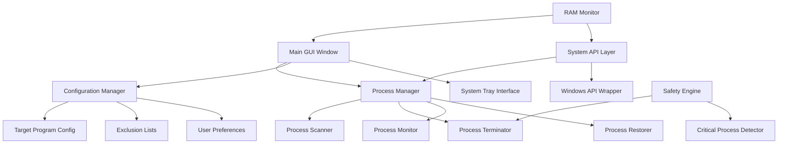

# RAM Optimizer - Technical Architecture Design

## Overview
A high-performance Windows application designed to maximize available RAM for priority programs by intelligently managing system processes. Built with C# and WPF for optimal performance and native Windows integration.

## System Architecture



## Core Components

### 1. Process Manager
**Responsibility**: Central coordination of all process operations
- **Process Scanner**: Enumerates running processes with detailed information
- **Process Terminator**: Safely terminates non-critical processes
- **Process Monitor**: Watches target applications and system state
- **Process Restorer**: Restarts previously terminated processes

### 2. Configuration Manager
**Responsibility**: Manages application settings and user preferences
- **Target Program Config**: Stores priority applications (executables and process names)
- **Exclusion Lists**: Maintains lists of protected processes
- **User Preferences**: UI settings, optimization modes, auto-start options

### 3. Safety Engine
**Responsibility**: Prevents system instability through intelligent process protection
- **Critical Process Detector**: Identifies essential Windows processes
- **Dynamic Learning**: Builds exclusion lists based on termination failures
- **Rollback System**: Quickly restores processes if system issues detected

### 4. System API Layer
**Responsibility**: Low-level Windows integration
- **Windows API Wrapper**: Clean interface for process manipulation
- **Performance Counters**: Real-time system metrics
- **Event Logging**: System event monitoring and logging

## Technical Implementation Strategy

### Process Selection Interface
- **Running Process View**: Real-time list with process details (PID, name, RAM usage, path)
- **Executable Browser**: File dialog to select .exe files for future monitoring
- **Saved Configurations**: Profile system for different optimization scenarios
- **Search/Filter**: Quick process finding and categorization

### Optimization Engine


### Safety Mechanisms
1. **Protected Process Categories**:
   - Windows System Processes (winlogon.exe, csrss.exe, etc.)
   - Security Services (antivirus, Windows Defender)
   - Critical Drivers and Services
   - User-defined exclusions

2. **Dynamic Protection Learning**:
   - Track termination attempts and system stability
   - Auto-add processes that cause issues to exclusion list
   - Confidence scoring for termination safety

3. **Graceful Termination Sequence**:
   - Send WM_CLOSE message first (graceful shutdown)
   - Wait timeout period for clean exit
   - Force termination if necessary
   - Log all termination activities

### Performance Optimizations

#### Application Lightweight Design
- **Minimal UI Framework**: WPF with custom lightweight controls
- **Efficient Process Monitoring**: Event-based instead of polling
- **Memory Management**: Aggressive garbage collection and resource disposal
- **System Tray Mode**: Hide main window when not actively used

#### Resource Management
- **Process Information Caching**: Cache process details to reduce API calls
- **Background Threading**: Async operations for UI responsiveness
- **Selective Monitoring**: Only monitor processes relevant to current operation

## User Interface Design

### Main Window Components
1. **RAM Usage Display**: Real-time memory statistics and optimization impact
2. **Target Program Selection**: Dual-mode selection (running/executable)
3. **Process List**: Categorized view with termination preview
4. **Control Panel**: Optimize/Restore buttons with status indicators
5. **Settings Access**: Quick access to configuration options

### System Tray Interface
- **Quick Actions**: One-click optimize/restore
- **Status Indicators**: Current optimization state
- **Target Program Menu**: Fast switching between saved configurations

## Configuration Storage

### Settings File Structure (JSON)
```json
{
  "targetPrograms": [
    {
      "name": "Gaming Profile",
      "executables": ["game.exe", "launcher.exe"],
      "autoOptimize": true,
      "aggressiveMode": true
    }
  ],
  "exclusionList": [
    "explorer.exe",
    "dwm.exe",
    "audiodg.exe"
  ],
  "userPreferences": {
    "startMinimized": true,
    "confirmTermination": false,
    "restoreTimeout": 30
  }
}
```

## Risk Mitigation

### Critical Process Protection
- **Hardcoded Core Exclusions**: Essential Windows processes never terminated
- **Service Dependency Analysis**: Check service dependencies before termination
- **Recovery Mechanisms**: Automatic process restart if system becomes unstable

### User Experience Safety
- **Preview Mode**: Show what will be terminated before execution
- **Undo Capability**: Quick restore function with process history
- **Safe Mode**: Conservative optimization option for new users

## Development Phases

### Phase 1: Core Infrastructure
- Basic WPF application structure
- Process enumeration and basic management
- Simple termination/restoration cycle

### Phase 2: Safety Systems
- Critical process detection
- Exclusion list management
- Error handling and logging

### Phase 3: Advanced Features
- Automatic monitoring
- Configuration profiles
- System tray integration

### Phase 4: Optimization & Polish
- Performance tuning
- UI refinements
- Comprehensive testing

## Technical Requirements

### System Requirements
- Windows 10/11 (64-bit)
- .NET 6.0 or later
- Administrative privileges (for process termination)
- Minimum 100MB disk space

### Dependencies
- Windows Process API
- WPF UI Framework
- System.Diagnostics namespace
- Windows Management Instrumentation (WMI)

This architecture ensures a robust, safe, and highly effective RAM optimization tool that maximizes performance while maintaining system stability.