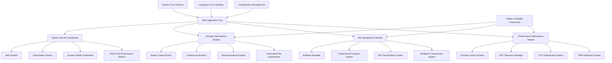
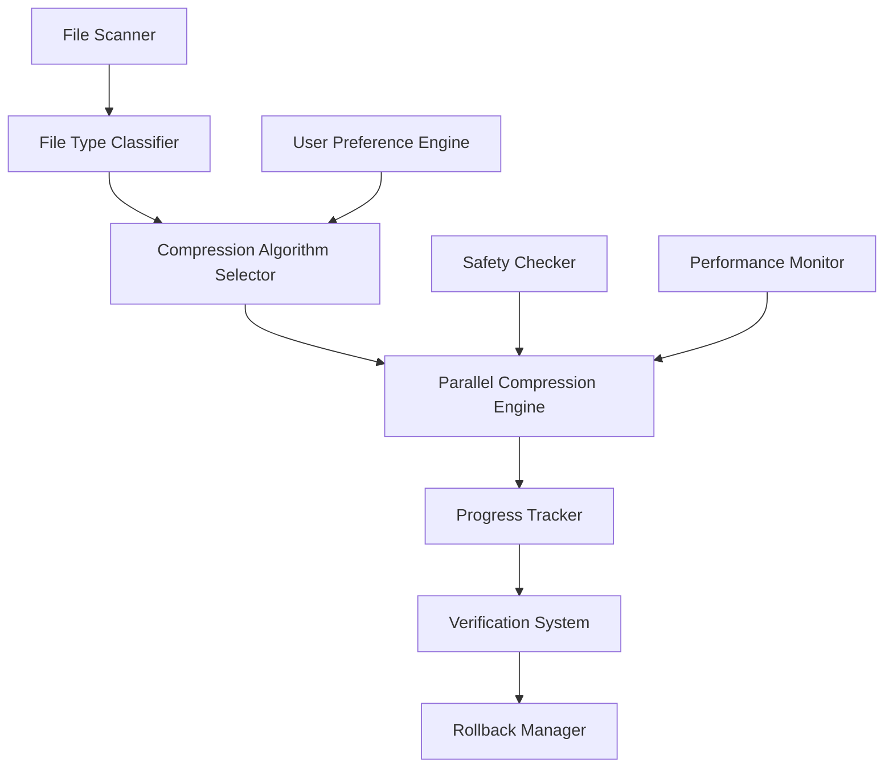
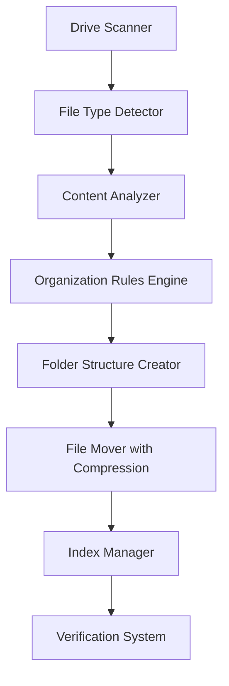

# Ultra-Aggressive Comprehensive System Optimizer - Expanded Architecture

## Overview
A comprehensive Windows system optimization application that goes beyond RAM management to provide CPU optimization, GPU resource allocation, intelligent file compression, and automated storage management through a sophisticated multi-module interface.

## System Architecture Overview



## Module 1: Performance Optimization Engine

### CPU Optimization System


**Core Components:**
- **CPU Usage Pattern Analyzer**: Real-time monitoring of CPU usage across cores
- **Process Priority Manager**: Dynamic priority adjustment based on target applications
- **CPU Affinity Controller**: Dedicate specific cores to priority applications
- **Thermal Management**: Prevent throttling through intelligent task distribution
- **Performance Core Allocation**: Optimize P-Core vs E-Core usage (Intel 12th gen+)

### GPU Resource Optimization


**Core Components:**
- **VRAM Allocator**: Monitor and optimize graphics memory usage
- **GPU Process Prioritizer**: Ensure target applications get maximum GPU resources
- **Hardware Acceleration Manager**: Control GPU acceleration for non-priority apps
- **GPU Scheduler**: Optimize Windows GPU scheduler for gaming/productivity
- **Multi-GPU Manager**: Optimize discrete vs integrated GPU usage

### Enhanced RAM Optimization (Expanded from Original)
- **7-Level Ultra-Aggressive Process Termination** (as previously designed)
- **Memory Compression Optimization**: Tune Windows memory compression
- **Page File Management**: Dynamic page file optimization
- **Memory Leak Detection**: Identify and terminate memory-leaking processes
- **RAM Disk Creation**: Create RAM disks for ultra-fast temporary storage

## Module 2: Intelligent File Compression System

### Compression Engine Architecture


### Type-Specific Compression Strategies

#### Executable Files (.exe, .dll, .sys)
```csharp
public class ExecutableCompressor
{
    // Preserve functionality while reducing size
    private readonly Dictionary<string, CompressionStrategy> _executableStrategies = new()
    {
        [".exe"] = new UPXCompressionStrategy(),     // UPX packer for executables
        [".dll"] = new LZMACompressionStrategy(),    // LZMA for libraries
        [".sys"] = new SafeCompressionStrategy(),    // Conservative for drivers
    };
    
    public async Task<CompressionResult> CompressExecutable(FileInfo file)
    {
        // Verify digital signatures before compression
        // Create backup for rollback
        // Apply compression while preserving execution capability
        // Verify functionality post-compression
    }
}
```

#### Document Files
```csharp
public class DocumentCompressor
{
    private readonly Dictionary<string, CompressionStrategy> _documentStrategies = new()
    {
        [".pdf"] = new PDFOptimizationStrategy(),     // Optimize PDF internal structure
        [".docx"] = new ZipOptimizationStrategy(),    // Optimize internal zip compression
        [".xlsx"] = new ExcelCompressionStrategy(),   // Optimize Excel specific data
        [".txt"] = new BrotliCompressionStrategy(),   // Maximum text compression
    };
}
```

#### Media Files
```csharp
public class MediaCompressor
{
    public enum CompressionMode
    {
        MaximumCompression,      // Re-encode with aggressive settings
        ArchiveMode,            // Compress without re-encoding
        SmartCompression        // Analyze and choose optimal method
    }
    
    // Video: Re-encode vs Archive compression options
    // Images: Lossless vs Lossy compression with quality controls
    // Audio: Format conversion with bitrate optimization
}
```

### Granular User Control System
```csharp
public class CompressionControlPanel
{
    public class FileCompressionRule
    {
        public string FilePattern { get; set; }          // *.docx, *.pdf, etc.
        public CompressionLevel Level { get; set; }      // None, Light, Aggressive, Maximum
        public bool PreserveFunctionality { get; set; }  // For executables
        public bool RequireConfirmation { get; set; }    // File-by-file approval
        public string DestinationFolder { get; set; }    // Where to store compressed files
    }
    
    // Batch processing with customizable rules
    // File-by-file decision interface
    // Preview compression ratios before applying
    // Queue management for large operations
}
```

## Module 3: Automated Storage Management

### File Organization Engine


### Intelligent File Categorization
```csharp
public class FileCategorizationEngine
{
    public class FileCategory
    {
        public string Name { get; set; }
        public List<string> Extensions { get; set; }
        public List<string> ContentPatterns { get; set; }
        public string DestinationPath { get; set; }
        public CompressionStrategy CompressionMethod { get; set; }
        public bool EnableCompression { get; set; }
    }
    
    private readonly List<FileCategory> _categories = new()
    {
        new() { Name = "PDF Documents", Extensions = new() {".pdf"}, 
                DestinationPath = @"C:\OrganizedFiles\Documents\PDFs", 
                EnableCompression = true, CompressionMethod = new PDFOptimizer() },
                
        new() { Name = "Word Documents", Extensions = new() {".docx", ".doc"}, 
                DestinationPath = @"C:\OrganizedFiles\Documents\Word", 
                EnableCompression = true, CompressionMethod = new OfficeOptimizer() },
                
        new() { Name = "Images", Extensions = new() {".jpg", ".png", ".gif", ".bmp"}, 
                DestinationPath = @"C:\OrganizedFiles\Media\Images", 
                EnableCompression = false }, // User choice: maintain accessibility
                
        new() { Name = "Videos", Extensions = new() {".mp4", ".avi", ".mkv"}, 
                DestinationPath = @"C:\OrganizedFiles\Media\Videos", 
                EnableCompression = false }, // Typically pre-compressed
    };
}
```

### Storage Analysis and Cleanup
```csharp
public class StorageAnalysisEngine
{
    public class StorageSuggestion
    {
        public string Description { get; set; }
        public long SpaceSavings { get; set; }
        public RiskLevel Risk { get; set; }
        public ActionType Action { get; set; } // Delete, Compress, Move, Archive
    }
    
    // Duplicate file detection with smart comparison
    // Large file identification with compression potential
    // Temporary file cleanup with safety checks
    // Old file archival with user confirmation
    // Cache cleanup for browsers and applications
}
```

## Module 4: Real-Time Performance Dashboard

### Performance Metrics Display
```csharp
public class PerformanceMonitor
{
    public class SystemMetrics
    {
        // CPU Metrics
        public double CPUUsageOverall { get; set; }
        public double[] CPUUsagePerCore { get; set; }
        public double CPUTemperature { get; set; }
        public double CPUClockSpeed { get; set; }
        
        // GPU Metrics  
        public double GPUUsage { get; set; }
        public double VRAMUsage { get; set; }
        public double GPUTemperature { get; set; }
        public double GPUMemoryBandwidth { get; set; }
        
        // RAM Metrics
        public long TotalRAM { get; set; }
        public long AvailableRAM { get; set; }
        public long CompressedMemory { get; set; }
        public double MemoryCompressionRatio { get; set; }
        
        // Storage Metrics
        public Dictionary<string, DriveInfo> DriveUsage { get; set; }
        public long TotalCompressionSavings { get; set; }
        public int FilesProcessedToday { get; set; }
    }
    
    // Real-time graphs with customizable time ranges
    // Alert thresholds for resource usage
    // Optimization impact tracking
    // Historical performance comparison
}
```

## Advanced Safety and Rollback Systems

### Comprehensive Rollback Manager
```csharp
public class RollbackManager
{
    public class SystemSnapshot
    {
        public DateTime Timestamp { get; set; }
        public List<ProcessInfo> TerminatedProcesses { get; set; }
        public Dictionary<string, RegistryBackup> RegistryChanges { get; set; }
        public List<FileOperation> FileOperations { get; set; }
        public SystemConfiguration SystemSettings { get; set; }
    }
    
    public class FileOperation
    {
        public string OriginalPath { get; set; }
        public string NewPath { get; set; }
        public string BackupPath { get; set; }
        public OperationType Type { get; set; } // Compress, Move, Delete
        public string OriginalHash { get; set; }
        public long OriginalSize { get; set; }
    }
    
    // Create system snapshots before major operations
    // File-level rollback for compression failures
    // Process restoration with dependency tracking
    // Registry rollback for system optimizations
    // Atomic operation grouping
}
```

### Safety Framework for File Operations
```csharp
public class FileSafetyEngine
{
    // Verify file integrity after compression
    // Test compressed files before deleting originals
    // Maintain file permissions and metadata
    // Create automatic backups of critical files
    // Monitor system stability during file operations
    // Implement pause/resume for long operations
}
```

## Modular User Interface Design

### Main Application Hub
```xml
<TabControl>
    <TabItem Header="Performance Dashboard">
        <!-- Real-time CPU/GPU/RAM monitoring -->
        <!-- System optimization controls -->
        <!-- Quick optimization buttons -->
    </TabItem>
    
    <TabItem Header="File Compression">
        <!-- File browser with compression preview -->
        <!-- Batch processing queue -->
        <!-- Compression settings and algorithms -->
        <!-- Progress tracking and statistics -->
    </TabItem>
    
    <TabItem Header="Storage Management">
        <!-- Drive analysis and cleanup suggestions -->
        <!-- File organization rules -->
        <!-- Automated cleanup scheduling -->
        <!-- Storage usage visualization -->
    </TabItem>
    
    <TabItem Header="System Optimization">
        <!-- Ultra-aggressive process management -->
        <!-- CPU and GPU optimization settings -->
        <!-- Memory management controls -->
        <!-- Optimization profiles -->
    </TabItem>
    
    <TabItem Header="Settings & History">
        <!-- Global preferences -->
        <!-- Optimization history and statistics -->
        <!-- Rollback and restore options -->
        <!-- Advanced configuration -->
    </TabItem>
</TabControl>
```

## Performance Expectations

### System Performance Gains
- **RAM**: 5-8GB freed through aggressive process termination
- **CPU**: 15-30% performance improvement through priority optimization
- **GPU**: 20-40% resource availability for priority applications
- **Storage**: 30-70% space savings through intelligent compression

### File Compression Results
- **Documents**: 50-80% size reduction with maintained accessibility
- **Executables**: 20-40% size reduction while preserving functionality
- **Media**: Variable based on user choice (accessibility vs compression)
- **Overall**: 40-60% average storage space savings

This comprehensive architecture provides ultra-aggressive optimization across all system resources while maintaining safety through intelligent monitoring and rollback capabilities.