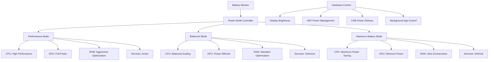

# Refined Compression Strategy & Comprehensive Battery Power Management

## 🔄 **Refined Transparent Compression Strategy**

### Smart Compression Classification
Only files requiring immediate access without decompression delays use transparent compression. All other files use standard compression with decompression-on-demand.

```csharp
public class SmartCompressionClassifier
{
    public enum CompressionMode
    {
        Transparent,        // Files need immediate access without decompression
        Standard,          // Files can be decompressed on-demand
        Archive           // Files rarely accessed, maximum compression
    }
    
    public CompressionMode DetermineCompressionMode(FileInfo file)
    {
        var extension = file.Extension.ToLower();
        var usage = GetFileUsagePattern(file);
        var location = GetFileLocation(file);
        
        // TRANSPARENT COMPRESSION: Files that must work immediately without decompression
        if (RequiresTransparentAccess(file, extension, usage, location))
        {
            return CompressionMode.Transparent;
        }
        
        // STANDARD COMPRESSION: Files that can afford brief decompression delay
        if (IsFrequentlyAccessed(usage) || IsRecentlyAccessed(usage))
        {
            return CompressionMode.Standard;
        }
        
        // ARCHIVE COMPRESSION: Maximum compression for rarely accessed files
        return CompressionMode.Archive;
    }
    
    private bool RequiresTransparentAccess(FileInfo file, string extension, UsagePattern usage, FileLocation location)
    {
        return extension switch
        {
            // Executables that need instant launching
            ".exe" when location == FileLocation.ProgramFiles => true,
            ".exe" when usage.IsFrequentlyLaunched => true,
            
            // System DLLs that are loaded dynamically
            ".dll" when location == FileLocation.System32 => true,
            ".dll" when location == FileLocation.ProgramFiles => true,
            
            // Documents frequently opened (daily use)
            ".pdf" when usage.AccessFrequency > 1.0 => true,  // >1 access per day
            ".docx" when usage.AccessFrequency > 1.0 => true,
            ".xlsx" when usage.AccessFrequency > 1.0 => true,
            
            // Media files in current projects
            _ when location == FileLocation.Desktop => true,
            _ when location == FileLocation.Documents && usage.IsCurrentProject => true,
            
            // Critical system files
            _ when IsCriticalSystemFile(file.FullName) => true,
            
            _ => false
        };
    }
}
```

### Transparent vs Standard Compression Matrix

| File Type | Transparent Compression | Standard Compression | Archive Compression |
|-----------|------------------------|-------------------|-------------------|
| **System Executables** | ✅ Instant launch required | ❌ | ❌ |
| **Program Files** | ✅ Dynamic loading needed | ❌ | ❌ |
| **Daily Documents** | ✅ Immediate access expected | ❌ | ❌ |
| **System DLLs** | ✅ Runtime loading required | ❌ | ❌ |
| **Active Project Files** | ✅ Frequent access patterns | ❌ | ❌ |
| **Weekly Documents** | ❌ | ✅ Brief delay acceptable | ❌ |
| **Media Collections** | ❌ | ✅ Decompression on play | ❌ |
| **Backup Files** | ❌ | ❌ | ✅ Maximum compression |
| **Old Download Files** | ❌ | ❌ | ✅ Space optimization |
| **Temporary Files** | ❌ | ❌ | ✅ Aggressive compression |

## 🔋 **Comprehensive Battery Power Management System**

### 3-Tier Power Optimization Architecture



### Power Mode Specifications

#### 🚀 Performance Mode (Plugged In / High Battery >70%)
```csharp
public class PerformanceMode : IPowerMode
{
    public string ModeName => "Performance - Optimize for Power While Maintaining Performance";
    
    public PowerSettings GetSettings()
    {
        return new PowerSettings
        {
            // CPU Settings
            CPUMinimumState = 50,           // Minimum 50% CPU frequency
            CPUMaximumState = 100,          // Maximum 100% CPU frequency
            CPUTurboBoost = true,           // Enable Turbo Boost
            CPUCoreParking = false,         // Keep all cores active
            
            // GPU Settings
            GPUPowerLimit = 100,            // 100% GPU power limit
            GPUClockSpeed = GPUClockSpeed.Maximum,
            GPUMemorySpeed = GPUMemorySpeed.Maximum,
            
            // System Settings
            RAMOptimization = RAMOptimizationLevel.Aggressive,  // Still optimize RAM
            BackgroundServices = ServiceLevel.Normal,          // Keep services running
            NetworkOptimization = false,                       // Full network capability
            StorageOptimization = true,                        // Continue compression
            
            // Hardware Settings
            DisplayBrightness = 100,        // Maximum brightness available
            WiFiPowerSaving = false,        // Full WiFi performance
            USBPowerManagement = false,     // Full USB power
            AudioOptimization = false       // Full audio quality
        };
    }
    
    public TimeSpan EstimatedBatteryLife => TimeSpan.FromHours(3.5);  // Baseline usage
}
```

#### ⚖️ Balanced Mode (Battery 30-70%)
```csharp
public class BalancedMode : IPowerMode
{
    public string ModeName => "Balanced - Performance Lowered to Save Power";
    
    public PowerSettings GetSettings()
    {
        return new PowerSettings
        {
            // CPU Settings
            CPUMinimumState = 25,           // Minimum 25% CPU frequency
            CPUMaximumState = 75,           // Maximum 75% CPU frequency  
            CPUTurboBoost = false,          // Disable Turbo Boost
            CPUCoreParking = true,          // Park unused cores
            
            // GPU Settings
            GPUPowerLimit = 70,             // 70% GPU power limit
            GPUClockSpeed = GPUClockSpeed.Balanced,
            GPUMemorySpeed = GPUMemorySpeed.PowerSaving,
            
            // System Settings
            RAMOptimization = RAMOptimizationLevel.UltraAggressive, // More RAM optimization
            BackgroundServices = ServiceLevel.Reduced,             // Reduce background services
            NetworkOptimization = true,                            // Enable network power saving
            StorageOptimization = true,                            // Continue compression
            
            // Hardware Settings
            DisplayBrightness = 70,         // Reduced brightness
            WiFiPowerSaving = true,         // Enable WiFi power saving
            USBPowerManagement = true,      // Reduce USB power
            AudioOptimization = true        // Reduce audio power consumption
        };
    }
    
    public async Task OptimizeForBalance()
    {
        // Reduce display refresh rate if possible
        await SetDisplayRefreshRate(60); // Down from 120Hz if available
        
        // Throttle background application refresh
        await ThrottleBackgroundApps(50); // 50% of normal refresh rate
        
        // Enable adaptive CPU scaling
        await EnableAdaptiveCPUScaling();
        
        // Reduce Windows animations
        await SetWindowsAnimations(AnimationLevel.Reduced);
    }
    
    public TimeSpan EstimatedBatteryLife => TimeSpan.FromHours(6.5);  // Significantly improved
}
```

#### 🔋 Maximum Battery Mode (Battery <30%)
```csharp
public class MaximumBatteryMode : IPowerMode
{
    public string ModeName => "Maximum Battery - Focus Specifically on Battery Conservation";
    
    public PowerSettings GetSettings()
    {
        return new PowerSettings
        {
            // CPU Settings
            CPUMinimumState = 5,            // Minimum 5% CPU frequency
            CPUMaximumState = 40,           // Maximum 40% CPU frequency
            CPUTurboBoost = false,          // Disable Turbo Boost
            CPUCoreParking = true,          // Aggressive core parking
            CPUSchedulingPolicy = SchedulingPolicy.PowerSaver,
            
            // GPU Settings
            GPUPowerLimit = 30,             // 30% GPU power limit
            GPUClockSpeed = GPUClockSpeed.Minimum,
            GPUMemorySpeed = GPUMemorySpeed.Minimum,
            DiscreteGPU = false,            // Force integrated GPU only
            
            // System Settings
            RAMOptimization = RAMOptimizationLevel.Extreme,     // Maximum RAM optimization
            BackgroundServices = ServiceLevel.Minimal,         // Minimal services only
            NetworkOptimization = true,                        // Aggressive network saving
            StorageOptimization = true,                        // Maximum compression
            
            // Hardware Settings
            DisplayBrightness = 30,         // Minimum usable brightness
            WiFiPowerSaving = true,         // Maximum WiFi power saving
            USBPowerManagement = true,      // Aggressive USB power management
            AudioOptimization = true,       // Minimum audio power
            BluetoothOptimization = true    // Disable when not needed
        };
    }
    
    public async Task OptimizeForMaximumBattery()
    {
        // Ultra-aggressive optimizations
        await SetDisplayRefreshRate(30);               // Minimum refresh rate
        await ReduceSystemVisualEffects();            // Disable all visual effects
        await ThrottleBackgroundApps(10);             // 10% background refresh rate
        await EnableUltraAggressiveProcessTermination(); // More aggressive than normal
        await ReduceNetworkPolling();                  // Reduce network activity
        await DisableNonEssentialHardware();          // Disable cameras, sensors, etc.
        await OptimizeWindowsSearchIndexing();        // Minimal indexing
        await DisableWindowsUpdateChecks();           // Defer updates
        
        // Extreme file compression mode
        await EnableExtremeCompressionMode();         // Maximum compression for all files
    }
    
    public TimeSpan EstimatedBatteryLife => TimeSpan.FromHours(12);  // Maximum battery extension
}
```

### Intelligent Power Mode Switching

```csharp
public class IntelligentPowerManager
{
    private readonly BatteryMonitor _batteryMonitor;
    private readonly PerformanceMonitor _performanceMonitor;
    private readonly UserBehaviorAnalyzer _behaviorAnalyzer;
    
    public class PowerModeController
    {
        public async Task AutoSwitchPowerMode()
        {
            var batteryLevel = await _batteryMonitor.GetBatteryLevel();
            var isPluggedIn = await _batteryMonitor.IsPluggedIn();
            var userActivity = await _behaviorAnalyzer.GetCurrentActivityLevel();
            var timeUntilNext = await _behaviorAnalyzer.EstimateTimeUntilNextCharge();
            
            var recommendedMode = DetermineOptimalMode(
                batteryLevel, isPluggedIn, userActivity, timeUntilNext);
            
            if (recommendedMode != _currentMode)
            {
                await SwitchToPowerMode(recommendedMode);
                await NotifyUser(recommendedMode, GetSwitchReason());
            }
        }
        
        private PowerMode DetermineOptimalMode(
            double batteryLevel, 
            bool isPluggedIn, 
            UserActivity activity, 
            TimeSpan timeUntilCharge)
        {
            // Always use Performance mode when plugged in
            if (isPluggedIn)
                return PowerMode.Performance;
            
            // Critical battery situations
            if (batteryLevel < 15)
                return PowerMode.MaximumBattery;
            
            // High activity with good battery
            if (activity == UserActivity.High && batteryLevel > 50)
                return PowerMode.Performance;
            
            // Long time until next charge
            if (timeUntilCharge > TimeSpan.FromHours(8) && batteryLevel < 70)
                return PowerMode.MaximumBattery;
            
            // Medium activity or medium battery
            if ((activity == UserActivity.Medium) || 
                (batteryLevel >= 30 && batteryLevel <= 70))
                return PowerMode.Balanced;
            
            // Low battery situations
            if (batteryLevel < 30)
                return PowerMode.MaximumBattery;
            
            // Default to balanced
            return PowerMode.Balanced;
        }
    }
}
```

### Hardware-Level Power Optimizations

```csharp
public class HardwarePowerController
{
    public async Task OptimizeHardwarePower(PowerMode mode)
    {
        switch (mode)
        {
            case PowerMode.Performance:
                await OptimizeForPerformance();
                break;
            case PowerMode.Balanced:
                await OptimizeForBalance();
                break;
            case PowerMode.MaximumBattery:
                await OptimizeForBattery();
                break;
        }
    }
    
    private async Task OptimizeForBattery()
    {
        // Display Optimizations
        await SetDisplayBrightness(30);               // Minimum usable brightness
        await SetDisplayTimeout(TimeSpan.FromMinutes(1)); // Quick display timeout
        await ReduceDisplayRefreshRate(30);           // Minimum refresh rate
        
        // Network Optimizations
        await EnableAggressiveWiFiPowerSaving();      // Maximum WiFi power saving
        await ReduceNetworkScanFrequency();           // Less frequent WiFi scanning
        await DisableBluetoothWhenIdle();             // Turn off Bluetooth when idle
        
        // CPU Optimizations
        await SetCPUGovernor(CPUGovernor.PowerSave);  // Minimum CPU usage
        await EnableIntelligentCoreParking();         // Park cores aggressively
        await ReduceCPUBoostFrequency(0);             // Disable all CPU boost
        
        // GPU Optimizations
        await ForceIntegratedGPU();                   // Disable discrete GPU
        await ReduceGPUClockSpeeds();                 // Minimum GPU clocks
        await DisableGPUBoost();                      // Disable GPU boost
        
        // Storage Optimizations
        await EnableAggressiveDiskPowerSaving();      // Spin down drives quickly
        await ReduceSSDWriteFrequency();              // Batch SSD writes
        
        // Background Process Optimizations
        await SuspendNonEssentialServices();          // Suspend unnecessary services
        await DelayWindowsUpdateChecks();             // Defer update checking
        await ReduceBackgroundAppActivity(5);         // Minimal background app activity
        
        // Hardware Feature Optimizations
        await DisableCameraWhenIdle();                // Turn off camera
        await ReduceUSBPowerDelivery();               // Minimize USB power
        await OptimizeAudioSubsystem();               // Reduce audio power consumption
    }
}
```

### Battery Life Estimation Engine

```csharp
public class BatteryLifeEstimator
{
    public class BatteryEstimate
    {
        public TimeSpan EstimatedTimeRemaining { get; set; }
        public double CurrentConsumptionRate { get; set; }
        public PowerMode OptimalMode { get; set; }
        public TimeSpan TimeGainFromModeSwitch { get; set; }
        public List<PowerSavingRecommendation> Recommendations { get; set; }
    }
    
    public async Task<BatteryEstimate> EstimateBatteryLife()
    {
        var currentLevel = await _batteryMonitor.GetBatteryLevel();
        var currentMode = _powerManager.GetCurrentMode();
        var recentConsumption = await CalculateRecentConsumptionRate();
        
        var estimate = new BatteryEstimate
        {
            CurrentConsumptionRate = recentConsumption,
            EstimatedTimeRemaining = CalculateTimeRemaining(currentLevel, recentConsumption)
        };
        
        // Calculate potential improvements from mode switching
        foreach (var mode in Enum.GetValues<PowerMode>())
        {
            if (mode != currentMode)
            {
                var potentialConsumption = GetExpectedConsumption(mode);
                var potentialTime = CalculateTimeRemaining(currentLevel, potentialConsumption);
                var timeGain = potentialTime - estimate.EstimatedTimeRemaining;
                
                if (timeGain > TimeSpan.FromMinutes(30)) // Significant improvement
                {
                    estimate.Recommendations.Add(new PowerSavingRecommendation
                    {
                        Action = $"Switch to {mode} mode",
                        EstimatedTimeSavings = timeGain,
                        ImpactLevel = CalculateImpactLevel(mode, currentMode)
                    });
                }
            }
        }
        
        return estimate;
    }
}
```

## 🔄 **Integration with Existing Optimization**

### Power-Aware Optimization Scheduler
```csharp
public class PowerAwareOptimizationScheduler
{
    public async Task ScheduleOptimizations(PowerMode currentMode)
    {
        switch (currentMode)
        {
            case PowerMode.Performance:
                // Run all optimizations aggressively
                await RunRAMOptimization(AggressionLevel.Maximum);
                await RunCompressionOptimization(CompressionLevel.Balanced);
                await RunCPUOptimization(CPUOptimizationLevel.Performance);
                break;
                
            case PowerMode.Balanced:
                // Optimize during low usage periods
                await ScheduleOptimizationsDuringIdle();
                await RunRAMOptimization(AggressionLevel.Moderate);
                await RunCompressionOptimization(CompressionLevel.PowerEfficient);
                break;
                
            case PowerMode.MaximumBattery:
                // Minimal optimizations to save power
                await RunCriticalOptimizationsOnly();
                await PauseNonEssentialCompressionTasks();
                await ConserveResourcesForCriticalTasks();
                break;
        }
    }
}
```

This refined system provides intelligent compression for immediate-access files only, while adding comprehensive 3-tier battery management perfect for your tablet laptop usage scenarios.