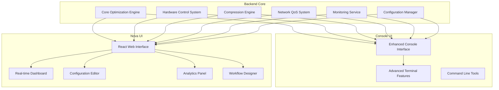
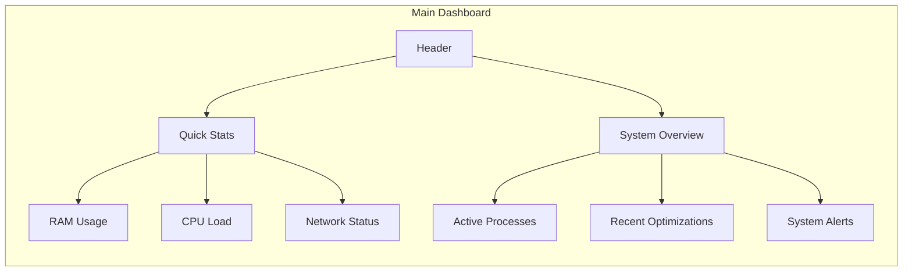
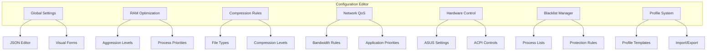
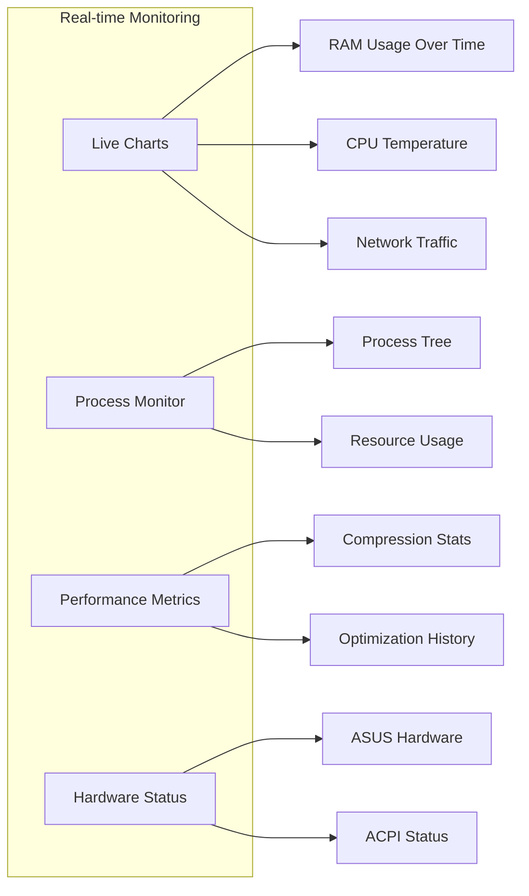
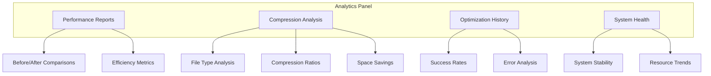
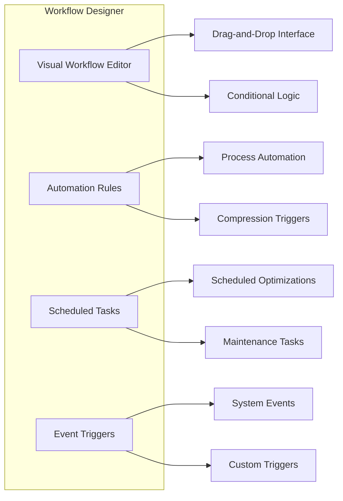
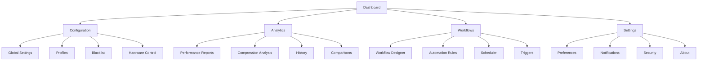

# Nova UI Architecture Design
## React-Based Technical User Interface

---

## 🎯 **EXECUTIVE SUMMARY**

Nova UI is designed for **technical users** who want **advanced customization** without the complexity of a full console interface. It bridges the gap between simple GUIs and complex CLI tools by providing:

- **Modular Configuration** - Fine-tune every aspect of optimization
- **Real-time Monitoring** - Live system metrics and performance data
- **Visual Analytics** - Charts, graphs, and detailed statistics
- **Custom Workflows** - Create and save optimization profiles
- **Professional Dashboard** - Clean, modern interface with advanced features

---

## 🏗️ **ARCHITECTURAL OVERVIEW**

### Dual-UI System Architecture



### Technology Stack

| Component | Technology | Purpose |
|-----------|------------|---------|
| **Frontend** | React 18 + TypeScript | Modern UI with TypeScript safety |
| **State Management** | Redux Toolkit + RTK Query | Centralized state management |
| **UI Framework** | Material-UI + Tailwind CSS | Professional components and styling |
| **Real-time** | WebSocket + SignalR | Live data streaming |
| **Charts** | Chart.js + D3.js | Data visualization |
| **Backend API** | ASP.NET Core 8 | RESTful API endpoints |
| **Database** | SQLite + Redis | Configuration and caching |
| **Authentication** | JWT + OAuth2 | Secure user management |

---

## 🎨 **NOVA UI COMPONENTS**

### 1. **Main Dashboard**


**Features:**
- Real-time system metrics
- Quick optimization controls
- Recent activity feed
- System health indicators

### 2. **Configuration Editor**


**Features:**
- Visual configuration forms
- JSON editor for advanced users
- Profile management system
- Import/export functionality

### 3. **Real-time Monitoring**


**Features:**
- Live updating charts
- Process monitoring
- Performance analytics
- Hardware status tracking

### 4. **Analytics Panel**


**Features:**
- Detailed performance reports
- Compression analytics
- Historical data analysis
- System health tracking

### 5. **Workflow Designer**


**Features:**
- Visual workflow creation
- Automation capabilities
- Scheduling system
- Event-driven triggers

---

## 🔧 **TECHNICAL IMPLEMENTATION**

### 1. **Backend API Design**

#### Core Endpoints
```typescript
// System Management
GET /api/system/status
GET /api/system/metrics
POST /api/system/optimize
GET /api/system/history

// Configuration Management
GET /api/config/global
PUT /api/config/global
POST /api/config/profiles
GET /api/config/profiles/{id}

// Real-time Data
WebSocket /api/ws/system
WebSocket /api/ws/processes
WebSocket /api/ws/performance

// Analytics
GET /api/analytics/performance
GET /api/analytics/compression
GET /api/analytics/history

// Workflows
GET /api/workflows
POST /api/workflows
PUT /api/workflows/{id}
DELETE /api/workflows/{id}
```

#### Data Models
```typescript
interface SystemStatus {
  ram: {
    total: number;
    used: number;
    available: number;
    percentage: number;
  };
  cpu: {
    usage: number;
    temperature: number;
    cores: number;
  };
  network: {
    download: number;
    upload: number;
    latency: number;
  };
  storage: {
    total: number;
    used: number;
    free: number;
  };
}

interface OptimizationProfile {
  id: string;
  name: string;
  description: string;
  ram: {
    aggressionLevel: number;
    processes: string[];
    blacklist: string[];
  };
  compression: {
    enabled: boolean;
    algorithms: string[];
    fileTypes: string[];
    compressionLevel: number;
  };
  network: {
    qosEnabled: boolean;
    priorities: Record<string, number>;
  };
  hardware: {
    asusControl: boolean;
    coreCount: number;
    performanceMode: string;
  };
  createdAt: Date;
  updatedAt: Date;
}

interface PerformanceMetrics {
  timestamp: Date;
  ram: {
    usage: number;
    optimized: number;
    savings: number;
  };
  cpu: {
    usage: number;
    temperature: number;
  };
  compression: {
    filesProcessed: number;
    spaceSaved: number;
    compressionRatio: number;
  };
  network: {
    bandwidth: number;
    qosApplied: boolean;
  };
}
```

### 2. **Frontend Architecture**

#### Component Structure
```typescript
// Core Components
├── NovaUI/
│   ├── components/
│   │   ├── common/
│   │   │   ├── Dashboard/
│   │   │   ├── Charts/
│   │   │   ├── Tables/
│   │   │   └── Forms/
│   │   ├── system/
│   │   │   ├── SystemStatus.tsx
│   │   │   ├── ProcessMonitor.tsx
│   │   │   └── HardwareMonitor.tsx
│   │   ├── configuration/
│   │   │   ├── ConfigEditor.tsx
│   │   │   ├── ProfileManager.tsx
│   │   │   └── BlacklistEditor.tsx
│   │   ├── analytics/
│   │   │   ├── PerformanceReports.tsx
│   │   │   ├── CompressionAnalytics.tsx
│   │   │   └── HistoryViewer.tsx
│   │   └── workflows/
│   │       ├── WorkflowDesigner.tsx
│   │       ├── AutomationRules.tsx
│   │       └── Scheduler.tsx
│   ├── pages/
│   │   ├── Dashboard/
│   │   ├── Configuration/
│   │   ├── Analytics/
│   │   ├── Workflows/
│   │   └── Settings/
│   ├── hooks/
│   │   ├── useSystemStatus.ts
│   │   ├── useConfiguration.ts
│   │   ├── useWebSocket.ts
│   │   └── useAnalytics.ts
│   ├── store/
│   │   ├── slices/
│   │   │   ├── systemSlice.ts
│   │   │   ├── configSlice.ts
│   │   │   ├── analyticsSlice.ts
│   │   │   └── workflowsSlice.ts
│   │   └── index.ts
│   └── utils/
│       ├── api.ts
│       ├── formatters.ts
│       └── constants.ts
```

#### State Management
```typescript
// Redux Store Structure
interface RootState {
  system: {
    status: SystemStatus;
    metrics: PerformanceMetrics[];
    loading: boolean;
    error: string | null;
  };
  configuration: {
    globalConfig: GlobalConfig;
    profiles: OptimizationProfile[];
    currentProfile: string | null;
    loading: boolean;
    error: string | null;
  };
  analytics: {
    performance: PerformanceReport[];
    compression: CompressionReport[];
    history: OptimizationHistory[];
    loading: boolean;
    error: string | null;
  };
  workflows: {
    workflows: Workflow[];
    activeWorkflow: string | null;
    loading: boolean;
    error: string | null;
  };
}
```

### 3. **Real-time Communication**

#### WebSocket Implementation
```typescript
class WebSocketManager {
  private ws: WebSocket | null = null;
  private reconnectAttempts = 0;
  private maxReconnectAttempts = 5;
  private reconnectDelay = 1000;

  connect(url: string) {
    this.ws = new WebSocket(url);
    
    this.ws.onopen = () => {
      console.log('WebSocket connected');
      this.reconnectAttempts = 0;
    };

    this.ws.onmessage = (event) => {
      const data = JSON.parse(event.data);
      this.handleMessage(data);
    };

    this.ws.onclose = () => {
      console.log('WebSocket disconnected');
      this.reconnect();
    };

    this.ws.onerror = (error) => {
      console.error('WebSocket error:', error);
    };
  }

  private handleMessage(data: any) {
    switch (data.type) {
      case 'system_status':
        store.dispatch(updateSystemStatus(data.payload));
        break;
      case 'performance_metrics':
        store.dispatch(addPerformanceMetrics(data.payload));
        break;
      case 'optimization_result':
        store.dispatch(addOptimizationResult(data.payload));
        break;
      case 'alert':
        store.dispatch(addSystemAlert(data.payload));
        break;
    }
  }

  private reconnect() {
    if (this.reconnectAttempts < this.maxReconnectAttempts) {
      this.reconnectAttempts++;
      setTimeout(() => {
        this.connect(this.ws?.url || '');
      }, this.reconnectDelay * this.reconnectAttempts);
    }
  }
}
```

---

## 🎯 **USER EXPERIENCE DESIGN**

### 1. **Target User Profile**

**Nova UI is designed for:**
- **Technical Users** - System administrators, power users, developers
- **Advanced Users** - Users who want fine-grained control
- **Customization Enthusiasts** - Users who love to configure and optimize
- **Professional Users** - Users who need detailed monitoring and reporting

**User Needs:**
- Fine-tune optimization parameters
- Monitor system performance in real-time
- Create custom optimization workflows
- Analyze optimization effectiveness
- Manage complex configurations

### 2. **Interface Design Principles**

#### **1. Progressive Disclosure**
- Basic controls visible by default
- Advanced options available on demand
- Context-sensitive help and tooltips

#### **2. Visual Hierarchy**
- Clear information architecture
- Important metrics prominently displayed
- Secondary information properly organized

#### **3. Real-time Feedback**
- Live updates for all system metrics
- Immediate visual feedback for user actions
- Progress indicators for long operations

#### **4. Customization**
- Drag-and-drop interface for workflows
- Customizable dashboard layouts
- Personalized configuration profiles

### 3. **Navigation Structure**



---

## 🔒 **SECURITY AND PRIVACY**

### 1. **Authentication System**
- JWT-based authentication
- Role-based access control
- Session management
- Secure password storage

### 2. **Data Protection**
- Encryption of sensitive configuration data
- Secure WebSocket connections
- Input validation and sanitization
- Audit logging for all actions

### 3. **Privacy Features**
- Local data storage option
- Anonymous usage statistics
- Configurable data retention
- Privacy-focused analytics

---

## 🚀 **DEPLOYMENT STRATEGY**

### 1. **Installation Options**

#### **Standalone Application**
- Single executable with embedded web server
- No external dependencies required
- Portable and easy to deploy

#### **Web Application**
- Hosted on internal servers
- Multi-user support
- Centralized configuration management

#### **Hybrid Mode**
- Desktop application with web interface
- Local and remote access options
- Synchronized configuration

### 2. **Configuration Management**

#### **Profile System**
```typescript
interface UserProfile {
  id: string;
  name: string;
  preferences: {
    theme: 'light' | 'dark' | 'auto';
    language: string;
    dashboardLayout: string[];
    notifications: {
      enabled: boolean;
      email: boolean;
      desktop: boolean;
    };
  };
  configurations: {
    defaultProfile: string;
    recentProfiles: string[];
  };
}
```

#### **Import/Export**
- JSON configuration files
- Profile templates
- Settings backup and restore
- Migration tools

---

## 📊 **PERFORMANCE OPTIMIZATION**

### 1. **Frontend Performance**
- Code splitting and lazy loading
- Component memoization
- Virtual scrolling for large lists
- Optimized re-rendering

### 2. **Backend Performance**
- Caching strategies
- Database optimization
- API rate limiting
- Background processing

### 3. **Real-time Performance**
- WebSocket connection pooling
- Message batching
- Efficient data serialization
- Client-side data processing

---

## 🎨 **THEMING AND CUSTOMIZATION**

### 1. **Visual Themes**
```typescript
interface Theme {
  name: string;
  colors: {
    primary: string;
    secondary: string;
    background: string;
    surface: string;
    text: string;
    error: string;
    warning: string;
    success: string;
  };
  typography: {
    fontFamily: string;
    fontSize: {
      xs: string;
      sm: string;
      base: string;
      lg: string;
      xl: string;
    };
  };
  spacing: {
    xs: string;
    sm: string;
    md: string;
    lg: string;
    xl: string;
  };
}
```

### 2. **Custom Components**
- Reusable UI components
- Plugin system for extensions
- Custom workflow nodes
- Third-party integrations

---

## 📈 **MONITORING AND ANALYTICS**

### 1. **Performance Metrics**
- System resource usage
- Application performance
- User engagement metrics
- Error tracking and reporting

### 2. **User Analytics**
- Feature usage patterns
- Configuration preferences
- Workflow complexity
- Optimization effectiveness

### 3. **System Analytics**
- Hardware compatibility
- Performance trends
- Error rates
- Resource utilization

---

## 🔮 **FUTURE ROADMAP**

### **Phase 1: Core Nova UI**
- [x] Architecture design
- [ ] React-based implementation
- [ ] Real-time dashboard
- [ ] Configuration editor

### **Phase 2: Advanced Features**
- [ ] Workflow designer
- [ ] Analytics panel
- [ ] Automation rules
- [ ] Scheduling system

### **Phase 3: Integration**
- [ ] Console UI integration
- [ ] Profile synchronization
- [ ] Multi-user support
- [ ] Mobile app

### **Phase 4: Advanced Analytics**
- [ ] Machine learning optimization
- [ ] Predictive analytics
- [ ] Advanced reporting
- [ ] API for third-party tools

---

## 🎯 **CONCLUSION**

Nova UI provides the perfect balance for technical users who want:

- **Advanced customization** without complexity
- **Real-time monitoring** with detailed analytics
- **Professional interface** with modern design
- **Flexible workflows** for automation
- **Comprehensive configuration** options

The dual-UI approach ensures that both console enthusiasts and technical GUI users can work with the powerful optimization engine in their preferred interface, while sharing the same robust backend system.