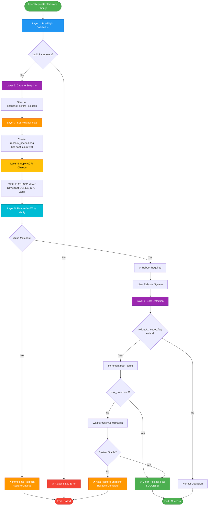
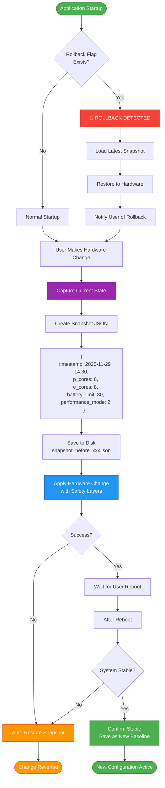
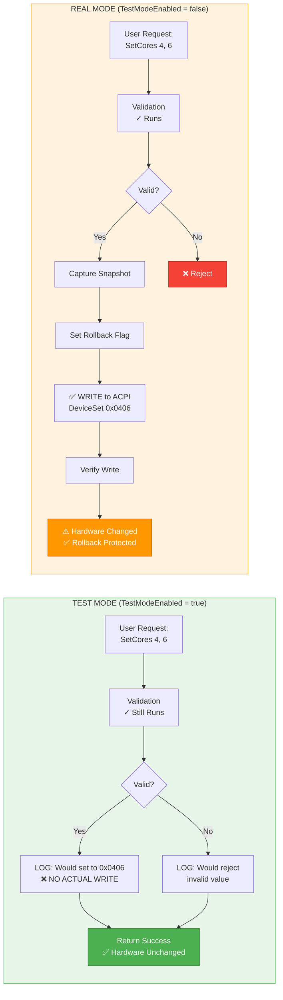
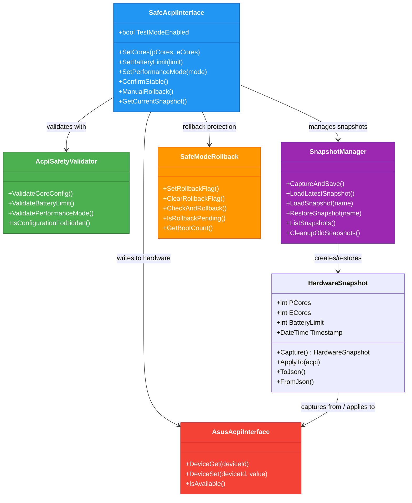
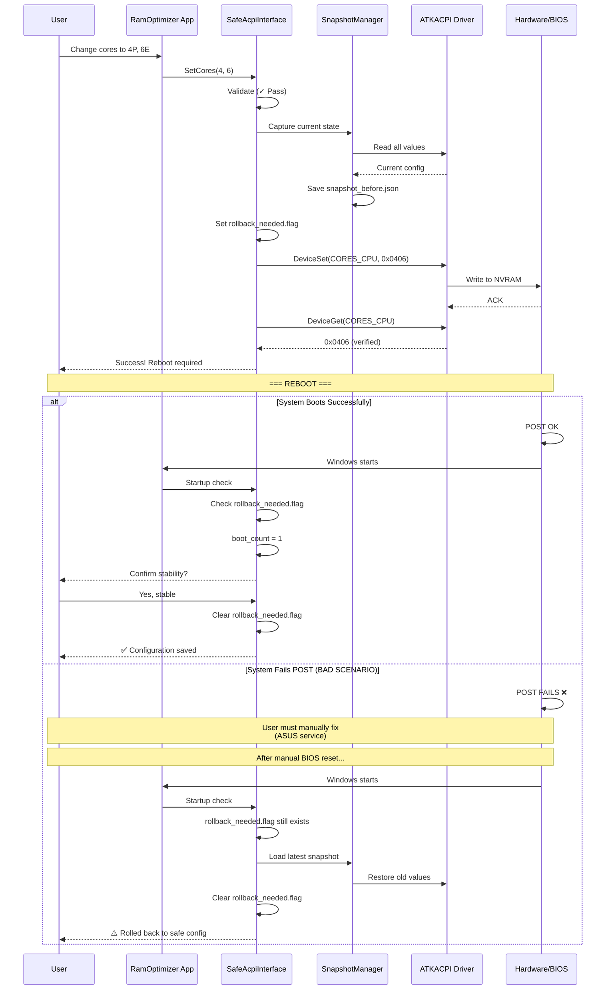
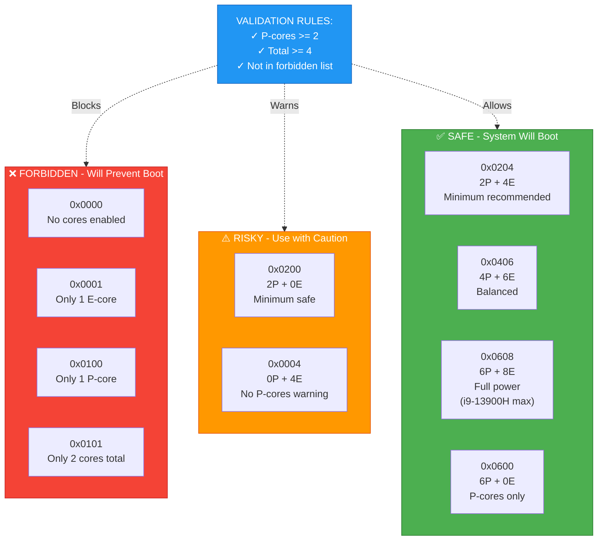
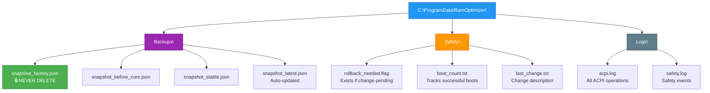
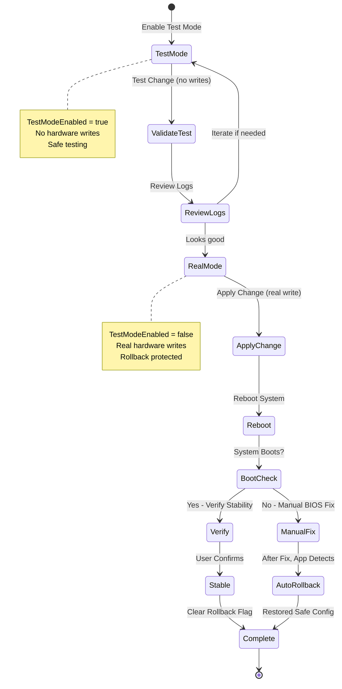

# ACPI Safety System - Visual Diagrams

**Actual visual flowcharts that render in VS Code, GitHub, and most markdown viewers**

---

## 🎯 Complete Safety Flow

---

## 🔄 Snapshot System Flow

---

## 🧪 Test Mode vs Real Mode

---

## 🏗️ Class Architecture

---

## 🚨 Boot Failure Scenario

---

## 📊 Forbidden vs Safe Values

---

## 📁 File System Structure

---

## 🔄 Recommended Workflow

---

## 📝 How to View These Diagrams

**In VS Code:**
1. Install extension: "Markdown Preview Mermaid Support"
2. Open this file
3. Press `Ctrl+Shift+V` (or `Cmd+Shift+V` on Mac)
4. Diagrams will render beautifully!

**On GitHub:**
- Just view the file - Mermaid renders automatically

**In Browser:**
- See the HTML version being created next!

