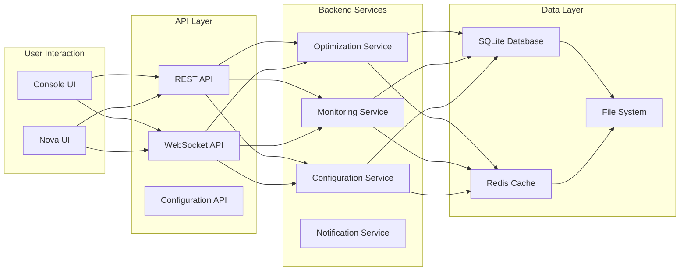

# Dual UI Integration Plan
## Console UI + Nova UI Integration Architecture

---

## 🎯 **EXECUTIVE SUMMARY**

This document outlines the integration strategy for connecting both the Console UI and Nova UI with a shared backend system. The dual-UI approach provides users with choice while maintaining a single, robust optimization engine.

### **Integration Goals**
- **Shared Backend** - Both UIs connect to the same optimization engine
- **Unified Configuration** - Settings and profiles sync between interfaces
- **Real-time Communication** - Live data updates across both UIs
- **Seamless Switching** - Users can switch between interfaces without losing state
- **Consistent Experience** - Both UIs provide the same functionality with different interfaces

---

## 🏗️ **INTEGRATION ARCHITECTURE**

### **System Architecture Overview**

```mermaid
graph TB
    subgraph "Backend Core"
        A[Core Optimization Engine]
        B[Hardware Control System]
        C[Compression Engine]
        D[Network QoS System]
        E[Monitoring Service]
        F[Configuration Manager]
        G[Database Layer]
        H[API Gateway]
    end
    
    subgraph "Console UI"
        I[Enhanced Console Interface]
        J[Command Line Interface]
        K[Real-time Console Display]
        L[Console Configuration]
    end
    
    subgraph "Nova UI"
        M[React Web Interface]
        N[Real-time Dashboard]
        O[Configuration Editor]
        P[Analytics Panel]
        Q[Workflow Designer]
    end
    
    subgraph "Shared Services"
        R[Configuration Service]
        S[Real-time Service]
        T[Authentication Service]
        U[Notification Service]
        V[Logging Service]
    end
    
    A --> H
    B --> H
    C --> H
    D --> H
    E --> H
    F --> H
    G --> H
    
    H --> I
    H --> M
    H --> R
    H --> S
    H --> T
    H --> U
    H --> V
    
    I --> J
    I --> K
    I --> L
    
    M --> N
    M --> O
    M --> P
    M --> Q
    
    R --> F
    S --> E
    T --> F
    U --> E
    V --> A
```



### **Data Flow Architecture**



---

## 🔧 **INTEGRATION IMPLEMENTATION**

### **1. Shared Backend API**

#### **API Gateway Configuration**
```typescript
// src/api/gateway.ts
import { createApi, fetchBaseQuery } from '@reduxjs/toolkit/query/react';
import { RootState } from '../store';

export const apiGateway = createApi({
  reducerPath: 'apiGateway',
  baseQuery: fetchBaseQuery({
    baseUrl: process.env.REACT_APP_API_URL || 'http://localhost:5000/api',
    prepareHeaders: (headers, { getState }) => {
      const token = (getState() as RootState).auth?.token;
      if (token) {
        headers.set('authorization', `Bearer ${token}`);
      }
      return headers;
    },
  }),
  tagTypes: ['System', 'Configuration', 'Analytics', 'Workflows'],
  endpoints: (builder) => ({
    // System endpoints
    getSystemStatus: builder.query<SystemStatus, void>({
      query: () => '/system/status',
      providesTags: ['System'],
    }),
    optimizeSystem: builder.mutation<void, OptimizationRequest>({
      query: (body) => ({
        url: '/system/optimize',
        method: 'POST',
        body,
      }),
      invalidatesTags: ['System', 'Analytics'],
    }),
    
    // Configuration endpoints
    getConfiguration: builder.query<GlobalConfig, void>({
      query: () => '/config/global',
      providesTags: ['Configuration'],
    }),
    updateConfiguration: builder.mutation<void, GlobalConfig>({
      query: (config) => ({
        url: '/config/global',
        method: 'PUT',
        body: config,
      }),
      invalidTags: ['Configuration'],
    }),
    
    // Analytics endpoints
    getPerformanceData: builder.query<PerformanceData, string>({
      query: (timeRange) => `/analytics/performance?range=${timeRange}`,
      providesTags: ['Analytics'],
    }),
    
    // WebSocket endpoints
    connectWebSocket: builder.mutation<void, void>({
      queryFn: () => ({ data: null }),
      async onQueryStarted(arg, { dispatch }) {
        // WebSocket connection logic
      },
    }),
  }),
});
```

#### **Real-time Communication Service**
```typescript
// src/services/realtimeService.ts
import { EventEmitter } from 'events';
import { store } from '../store';
import { 
  updateSystemStatus, 
  addPerformanceMetrics, 
  addOptimizationResult 
} from '../store/slices/systemSlice';

class RealtimeService extends EventEmitter {
  private ws: WebSocket | null = null;
  private reconnectAttempts = 0;
  private maxReconnectAttempts = 5;
  private reconnectDelay = 1000;

  connect(url: string = 'ws://localhost:5000') {
    this.ws = new WebSocket(url);
    
    this.ws.onopen = () => {
      console.log('Realtime service connected');
      this.reconnectAttempts = 0;
      this.requestInitialData();
    };

    this.ws.onmessage = (event) => {
      this.handleMessage(event.data);
    };

    this.ws.onclose = () => {
      console.log('Realtime service disconnected');
      this.reconnect();
    };

    this.ws.onerror = (error) => {
      console.error('Realtime service error:', error);
    };
  }

  private handleMessage(data: string) {
    try {
      const message = JSON.parse(data);
      
      switch (message.type) {
        case 'system_status':
          store.dispatch(updateSystemStatus(message.payload));
          break;
        case 'performance_metrics':
          store.dispatch(addPerformanceMetrics(message.payload));
          break;
        case 'optimization_result':
          store.dispatch(addOptimizationResult(message.payload));
          break;
        case 'notification':
          this.emit('notification', message.payload);
          break;
        case 'configuration_update':
          store.dispatch(updateConfiguration(message.payload));
          break;
      }
    } catch (error) {
      console.error('Error handling realtime message:', error);
    }
  }

  private requestInitialData() {
    this.ws?.send(JSON.stringify({
      type: 'subscribe',
      channels: ['system', 'performance', 'optimization', 'configuration']
    }));
  }

  private reconnect() {
    if (this.reconnectAttempts < this.maxReconnectAttempts) {
      this.reconnectAttempts++;
      setTimeout(() => {
        this.connect();
      }, this.reconnectDelay * Math.pow(2, this.reconnectAttempts - 1));
    }
  }

  disconnect() {
    this.ws?.close();
  }

  sendCommand(command: string, payload: any) {
    if (this.ws && this.ws.readyState === WebSocket.OPEN) {
      this.ws.send(JSON.stringify({
        type: 'command',
        command,
        payload,
        timestamp: new Date().toISOString()
      }));
    }
  }
}

export const realtimeService = new RealtimeService();
```

### **2. Configuration Synchronization**

#### **Configuration Manager**
```typescript
// src/services/configurationService.ts
import { store } from '../store';
import { apiGateway } from '../api/gateway';
import { 
  updateConfiguration, 
  setActiveProfile,
  addProfile 
} from '../store/slices/configSlice';

class ConfigurationService {
  private syncInterval: NodeJS.Timeout | null = null;
  private lastSyncTime = 0;

  startSync(interval: number = 30000) {
    this.syncInterval = setInterval(() => {
      this.syncConfiguration();
    }, interval);
  }

  stopSync() {
    if (this.syncInterval) {
      clearInterval(this.syncInterval);
      this.syncInterval = null;
    }
  }

  async syncConfiguration() {
    try {
      const response = await apiGateway.getConfiguration();
      store.dispatch(updateConfiguration(response.data));
      
      // Sync with console UI if needed
      this.notifyConsoleUI('configuration_update', response.data);
      
      this.lastSyncTime = Date.now();
    } catch (error) {
      console.error('Configuration sync failed:', error);
    }
  }

  async updateConfiguration(config: GlobalConfig) {
    try {
      await apiGateway.updateConfiguration(config);
      store.dispatch(updateConfiguration(config));
      
      // Notify both UIs
      this.notifyConsoleUI('configuration_update', config);
      this.notifyNovaUI('configuration_update', config);
      
      return true;
    } catch (error) {
      console.error('Configuration update failed:', error);
      return false;
    }
  }

  async saveProfile(profile: OptimizationProfile) {
    try {
      const response = await apiGateway.createProfile(profile);
      store.dispatch(addProfile(response.data));
      
      // Notify both UIs
      this.notifyConsoleUI('profile_created', response.data);
      this.notifyNovaUI('profile_created', response.data);
      
      return response.data;
    } catch (error) {
      console.error('Profile save failed:', error);
      throw error;
    }
  }

  async loadProfile(profileId: string) {
    try {
      const response = await apiGateway.getProfile(profileId);
      store.dispatch(setActiveProfile(response.data));
      
      // Notify both UIs
      this.notifyConsoleUI('profile_loaded', response.data);
      this.notifyNovaUI('profile_loaded', response.data);
      
      return response.data;
    } catch (error) {
      console.error('Profile load failed:', error);
      throw error;
    }
  }

  private notifyConsoleUI(type: string, data: any) {
    // Send message to console UI via IPC or file-based communication
    if (window.electronAPI) {
      window.electronAPI.send('ui-message', { type, data });
    }
  }

  private notifyNovaUI(type: string, data: any) {
    // Send message to Nova UI via WebSocket or event system
    realtimeService.emit('ui-message', { type, data });
  }

  exportConfiguration(): string {
    const config = store.getState().config;
    return JSON.stringify(config, null, 2);
  }

  importConfiguration(configJson: string): boolean {
    try {
      const config = JSON.parse(configJson);
      store.dispatch(updateConfiguration(config));
      return true;
    } catch (error) {
      console.error('Configuration import failed:', error);
      return false;
    }
  }
}

export const configurationService = new ConfigurationService();
```

### **3. UI Switching System**

#### **UI Manager**
```typescript
// src/services/uiManager.ts
import { store } from '../store';
import { setCurrentUI, setUIPreferences } from '../store/slices/uiSlice';

export enum UIType {
  CONSOLE = 'console',
  NOVA = 'nova'
}

class UIManager {
  private currentUI: UIType = UIType.NOVA;
  private preferences: UIPreferences;

  constructor() {
    this.loadPreferences();
  }

  switchToUI(uiType: UIType) {
    if (this.currentUI === uiType) return;

    this.currentUI = uiType;
    store.dispatch(setCurrentUI(uiType));
    
    // Save preference
    this.preferences.lastUsedUI = uiType;
    this.savePreferences();
    
    // Notify both UIs
    this.notifyUIChange(uiType);
    
    // Perform UI-specific setup
    this.setupUI(uiType);
  }

  getCurrentUI(): UIType {
    return this.currentUI;
  }

  getPreferences(): UIPreferences {
    return this.preferences;
  }

  private loadPreferences() {
    const saved = localStorage.getItem('ui-preferences');
    if (saved) {
      this.preferences = JSON.parse(saved);
    } else {
      this.preferences = {
        theme: 'auto',
        language: 'en',
        lastUsedUI: UIType.NOVA,
        dashboardLayout: [],
        notifications: {
          enabled: true,
          email: false,
          desktop: true
        }
      };
    }
  }

  private savePreferences() {
    localStorage.setItem('ui-preferences', JSON.stringify(this.preferences));
    store.dispatch(setUIPreferences(this.preferences));
  }

  private notifyUIChange(uiType: UIType) {
    // Notify console UI
    if (window.electronAPI) {
      window.electronAPI.send('ui-switch', { type: uiType });
    }
    
    // Notify Nova UI
    realtimeService.emit('ui-switch', { type: uiType });
  }

  private setupUI(uiType: UIType) {
    switch (uiType) {
      case UIType.CONSOLE:
        this.setupConsoleUI();
        break;
      case UIType.NOVA:
        this.setupNovaUI();
        break;
    }
  }

  private setupConsoleUI() {
    // Setup console-specific configurations
    console.log('Switching to Console UI');
    
    // Start console-specific services
    if (window.electronAPI) {
      window.electronAPI.startConsoleMode();
    }
  }

  private setupNovaUI() {
    // Setup Nova UI specific configurations
    console.log('Switching to Nova UI');
    
    // Start Nova UI specific services
    realtimeService.connect();
  }

  updatePreferences(updates: Partial<UIPreferences>) {
    this.preferences = { ...this.preferences, ...updates };
    this.savePreferences();
  }
}

export const uiManager = new UIManager();
```

### **4. Shared State Management**

#### **Unified Store**
```typescript
// src/store/index.ts
import { configureStore } from '@reduxjs/toolkit';
import { systemSlice } from './slices/systemSlice';
import { configSlice } from './slices/configSlice';
import { analyticsSlice } from './slices/analyticsSlice';
import { workflowsSlice } from './slices/workflowsSlice';
import { uiSlice } from './slices/uiSlice';
import { authSlice } from './slices/authSlice';

export const store = configureStore({
  reducer: {
    system: systemSlice.reducer,
    config: configSlice.reducer,
    analytics: analyticsSlice.reducer,
    workflows: workflowsSlice.reducer,
    ui: uiSlice.reducer,
    auth: authSlice.reducer,
  },
  middleware: (getDefaultMiddleware) =>
    getDefaultMiddleware({
      serializableCheck: {
        ignoredActions: ['persist/PERSIST', 'persist/REHYDRATE'],
      },
    }),
});

export type RootState = ReturnType<typeof store.getState>;
export type AppDispatch = typeof store.dispatch;
```

#### **Shared State Synchronization**
```typescript
// src/store/slices/sharedSlice.ts
import { createSlice, PayloadAction } from '@reduxjs/toolkit';

interface SharedState {
  lastSyncTime: number;
  syncStatus: 'idle' | 'syncing' | 'success' | 'error';
  activeUI: 'console' | 'nova';
  sharedData: {
    systemStatus: any;
    configuration: any;
    performanceData: any;
  };
}

const initialState: SharedState = {
  lastSyncTime: 0,
  syncStatus: 'idle',
  activeUI: 'nova',
  sharedData: {
    systemStatus: null,
    configuration: null,
    performanceData: null,
  },
};

const sharedSlice = createSlice({
  name: 'shared',
  initialState,
  reducers: {
    syncStart: (state) => {
      state.syncStatus = 'syncing';
    },
    syncSuccess: (state, action: PayloadAction<{ data: any }>) => {
      state.syncStatus = 'success';
      state.lastSyncTime = Date.now();
      state.sharedData = action.payload.data;
    },
    syncError: (state) => {
      state.syncStatus = 'error';
    },
    setActiveUI: (state, action: PayloadAction<'console' | 'nova'>) => {
      state.activeUI = action.payload;
    },
    updateSharedData: (state, action: PayloadAction<Partial<SharedState['sharedData']>>) => {
      state.sharedData = { ...state.sharedData, ...action.payload };
    },
  },
});

export const {
  syncStart,
  syncSuccess,
  syncError,
  setActiveUI,
  updateSharedData,
} = sharedSlice.actions;

export default sharedSlice.reducer;
```

### **5. Notification System**

#### **Unified Notification Service**
```typescript
// src/services/notificationService.ts
import { store } from '../store';
import { addNotification } from '../store/slices/uiSlice';

export enum NotificationType {
  INFO = 'info',
  SUCCESS = 'success',
  WARNING = 'warning',
  ERROR = 'error',
}

interface Notification {
  id: string;
  type: NotificationType;
  title: string;
  message: string;
  timestamp: Date;
  read: boolean;
  actions?: Array<{
    label: string;
    action: string;
    callback?: () => void;
  }>;
}

class NotificationService {
  private notifications: Map<string, Notification> = new Map();

  showNotification(
    type: NotificationType,
    title: string,
    message: string,
    actions?: Notification['actions']
  ) {
    const notification: Notification = {
      id: `notification_${Date.now()}`,
      type,
      title,
      message,
      timestamp: new Date(),
      read: false,
      actions,
    };

    this.notifications.set(notification.id, notification);
    store.dispatch(addNotification(notification));

    // Show in both UIs
    this.showInConsoleUI(notification);
    this.showInNovaUI(notification);

    // Auto-dismiss after 5 seconds
    setTimeout(() => {
      this.dismissNotification(notification.id);
    }, 5000);
  }

  private showInConsoleUI(notification: Notification) {
    if (window.electronAPI) {
      window.electronAPI.send('notification', notification);
    }
  }

  private showInNovaUI(notification: Notification) {
    // Nova UI notification handling
    realtimeService.emit('notification', notification);
  }

  dismissNotification(id: string) {
    this.notifications.delete(id);
    store.dispatch(dismissNotification(id));
  }

  markAsRead(id: string) {
    const notification = this.notifications.get(id);
    if (notification) {
      notification.read = true;
      this.notifications.set(id, notification);
      store.dispatch(updateNotification(notification));
    }
  }

  getNotifications(): Notification[] {
    return Array.from(this.notifications.values());
  }

  clearAllNotifications() {
    this.notifications.clear();
    store.dispatch(clearNotifications());
  }

  // Convenience methods
  showSuccess(title: string, message: string, actions?: Notification['actions']) {
    this.showNotification(NotificationType.SUCCESS, title, message, actions);
  }

  showError(title: string, message: string, actions?: Notification['actions']) {
    this.showNotification(NotificationType.ERROR, title, message, actions);
  }

  showWarning(title: string, message: string, actions?: Notification['actions']) {
    this.showNotification(NotificationType.WARNING, title, message, actions);
  }

  showInfo(title: string, message: string, actions?: Notification['actions']) {
    this.showNotification(NotificationType.INFO, title, message, actions);
  }
}

export const notificationService = new NotificationService();
```

### **6. Performance Monitoring**

#### **Cross-UI Performance Monitor**
```typescript
// src/services/performanceMonitor.ts
import { store } from '../store';
import { addPerformanceMetrics } from '../store/slices/systemSlice';

class PerformanceMonitor {
  private metrics: Map<string, PerformanceMetrics[]> = new Map();
  private monitoringInterval: NodeJS.Timeout | null = null;

  startMonitoring(interval: number = 1000) {
    this.monitoringInterval = setInterval(() => {
      this.collectMetrics();
    }, interval);
  }

  stopMonitoring() {
    if (this.monitoringInterval) {
      clearInterval(this.monitoringInterval);
      this.monitoringInterval = null;
    }
  }

  private collectMetrics() {
    const metrics = {
      timestamp: new Date(),
      ui: {
        console: this.getConsoleUIMetrics(),
        nova: this.getNovaUIMetrics(),
      },
      system: this.getSystemMetrics(),
      network: this.getNetworkMetrics(),
    };

    // Store metrics
    this.storeMetrics(metrics);

    // Update Redux store
    store.dispatch(addPerformanceMetrics(metrics));

    // Send to both UIs
    this.sendToUIs(metrics);
  }

  private getConsoleUIMetrics(): ConsoleUIMetrics {
    return {
      renderTime: this.measureRenderTime(),
      memoryUsage: this.getMemoryUsage(),
      cpuUsage: this.getCPUUsage(),
      responseTime: this.getResponseTime(),
    };
  }

  private getNovaUIMetrics(): NovaUIMetrics {
    return {
      componentRenderTime: this.measureComponentRenderTime(),
      memoryUsage: this.getMemoryUsage(),
      networkLatency: this.getNetworkLatency(),
      bundleSize: this.getBundleSize(),
    };
  }

  private getSystemMetrics(): SystemMetrics {
    return {
      cpu: this.getSystemCPU(),
      memory: this.getSystemMemory(),
      disk: this.getSystemDisk(),
      network: this.getSystemNetwork(),
    };
  }

  private getNetworkMetrics(): NetworkMetrics {
    return {
      latency: this.getNetworkLatency(),
      bandwidth: this.getBandwidth(),
      packetLoss: this.getPacketLoss(),
    };
  }

  private storeMetrics(metrics: any) {
    const timestamp = metrics.timestamp.toISOString();
    this.metrics.set(timestamp, metrics);
    
    // Keep only last 1000 metrics
    if (this.metrics.size > 1000) {
      const oldestKey = this.metrics.keys().next().value;
      this.metrics.delete(oldestKey);
    }
  }

  private sendToUIs(metrics: any) {
    // Send to console UI
    if (window.electronAPI) {
      window.electronAPI.send('performance-metrics', metrics);
    }
    
    // Send to Nova UI
    realtimeService.emit('performance-metrics', metrics);
  }

  private measureRenderTime(): number {
    // Implementation for measuring console UI render time
    return 0;
  }

  private measureComponentRenderTime(): number {
    // Implementation for measuring Nova UI component render time
    return 0;
  }

  private getMemoryUsage(): number {
    return (performance as any).memory?.usedJSHeapSize || 0;
  }

  private getCPUUsage(): number {
    // Implementation for CPU usage measurement
    return 0;
  }

  private getResponseTime(): number {
    // Implementation for response time measurement
    return 0;
  }

  private getNetworkLatency(): number {
    // Implementation for network latency measurement
    return 0;
  }

  private getBandwidth(): number {
    // Implementation for bandwidth measurement
    return 0;
  }

  private getPacketLoss(): number {
    // Implementation for packet loss measurement
    return 0;
  }

  private getSystemCPU(): number {
    // Implementation for system CPU measurement
    return 0;
  }

  private getSystemMemory(): number {
    // Implementation for system memory measurement
    return 0;
  }

  private getSystemDisk(): number {
    // Implementation for system disk measurement
    return 0;
  }

  private getSystemNetwork(): number {
    // Implementation for system network measurement
    return 0;
  }

  getMetricsHistory(): Map<string, PerformanceMetrics[]> {
    return new Map(this.metrics);
  }

  getPerformanceReport(): PerformanceReport {
    const allMetrics = Array.from(this.metrics.values());
    
    return {
      totalMetrics: allMetrics.length,
      averageRenderTime: this.calculateAverage(allMetrics.map(m => m.ui.console.renderTime)),
      averageMemoryUsage: this.calculateAverage(allMetrics.map(m => m.ui.console.memoryUsage)),
      averageCPUUsage: this.calculateAverage(allMetrics.map(m => m.ui.console.cpuUsage)),
      peakMemoryUsage: Math.max(...allMetrics.map(m => m.ui.console.memoryUsage)),
      peakCPUUsage: Math.max(...allMetrics.map(m => m.ui.console.cpuUsage)),
      timestamp: new Date(),
    };
  }

  private calculateAverage(values: number[]): number {
    return values.reduce((sum, val) => sum + val, 0) / values.length;
  }
}

export const performanceMonitor = new PerformanceMonitor();
```

---

## 🎨 **USER EXPERIENCE INTEGRATION**

### **1. Seamless UI Switching**

#### **UI Switcher Component**
```typescript
// src/components/common/UISwitcher.tsx
import React from 'react';
import { 
  Button, 
  Menu, 
  MenuItem, 
  Box, 
  Typography,
  Divider,
  IconButton
} from '@mui/material';
import { 
  Computer, 
  Web, 
  SwapHoriz,
  Settings
} from '@mui/icons-material';
import { uiManager, UIType } from '../../services/uiManager';
import { useUIPreferences } from '../../hooks/useUIPreferences';

export const UISwitcher: React.FC = () => {
  const [anchorEl, setAnchorEl] = React.useState<null | HTMLElement>(null);
  const { preferences, updatePreferences } = useUIPreferences();
  const currentUI = uiManager.getCurrentUI();

  const handleMenuOpen = (event: React.MouseEvent<HTMLElement>) => {
    setAnchorEl(event.currentTarget);
  };

  const handleMenuClose = () => {
    setAnchorEl(null);
  };

  const switchToConsole = () => {
    uiManager.switchToUI(UIType.CONSOLE);
    handleMenuClose();
  };

  const switchToNova = () => {
    uiManager.switchToUI(UIType.NOVA);
    handleMenuClose();
  };

  const openSettings = () => {
    handleMenuClose();
    // Open settings dialog
  };

  return (
    <Box>
      <Button
        variant="outlined"
        startIcon={<SwapHoriz />}
        onClick={handleMenuOpen}
        sx={{ mr: 2 }}
      >
        Switch UI
      </Button>

      <Menu
        anchorEl={anchorEl}
        open={Boolean(anchorEl)}
        onClose={handleMenuClose}
      >
        <MenuItem 
          onClick={switchToNova}
          selected={currentUI === UIType.NOVA}
          disabled={currentUI === UIType.NOVA}
        >
          <Web sx={{ mr: 2 }} />
          Nova UI (Web Interface)
        </MenuItem>
        
        <Divider />
        
        <MenuItem 
          onClick={switchToConsole}
          selected={currentUI === UIType.CONSOLE}
          disabled={currentUI === UIType.CONSOLE}
        >
          <Computer sx={{ mr: 2 }} />
          Console UI (Terminal)
        </MenuItem>
        
        <Divider />
        
        <MenuItem onClick={openSettings}>
          <Settings sx={{ mr: 2 }} />
          UI Settings
        </MenuItem>
      </Menu>
    </Box>
  );
};
```

### **2. Shared Configuration Interface**

#### **Configuration Sync Component**
```typescript
// src/components/common/ConfigurationSync.tsx
import React, { useEffect, useState } from 'react';
import { 
  Box, 
  Typography, 
  LinearProgress, 
  Alert,
  Button,
  Dialog,
  DialogTitle,
  DialogContent,
  DialogActions
} from '@mui/material';
import { 
  Sync, 
  CheckCircle, 
  Error,
  CloudUpload,
  CloudDownload
} from '@mui/icons-material';
import { configurationService } from '../../services/configurationService';
import { useConfiguration } from '../../hooks/useConfiguration';

export const ConfigurationSync: React.FC = () => {
  const { config, loading, error } = useConfiguration();
  const [syncStatus, setSyncStatus] = useState<'idle' | 'syncing' | 'success' | 'error'>('idle');
  const [lastSyncTime, setLastSyncTime] = useState<Date | null>(null);
  const [syncDialogOpen, setSyncDialogOpen] = useState(false);

  useEffect(() => {
    // Start automatic sync
    configurationService.startSync();
    
    return () => {
      configurationService.stopSync();
    };
  }, []);

  const handleManualSync = async () => {
    setSyncStatus('syncing');
    try {
      await configurationService.syncConfiguration();
      setSyncStatus('success');
      setLastSyncTime(new Date());
    } catch (error) {
      setSyncStatus('error');
    }
  };

  const handleExportConfig = () => {
    const configJson = configurationService.exportConfiguration();
    const blob = new Blob([configJson], { type: 'application/json' });
    const url = URL.createObjectURL(blob);
    const a = document.createElement('a');
    a.href = url;
    a.download = 'ram-optimizer-config.json';
    a.click();
    URL.revokeObjectURL(url);
  };

  const handleImportConfig = (event: React.ChangeEvent<HTMLInputElement>) => {
    const file = event.target.files?.[0];
    if (file) {
      const reader = new FileReader();
      reader.onload = (e) => {
        const configJson = e.target?.result as string;
        const success = configurationService.importConfiguration(configJson);
        if (success) {
          setSyncStatus('success');
          setLastSyncTime(new Date());
        } else {
          setSyncStatus('error');
        }
      };
      reader.readAsText(file);
    }
  };

  return (
    <Box>
      <Box sx={{ display: 'flex', alignItems: 'center', mb: 2 }}>
        <Sync sx={{ mr: 1 }} />
        <Typography variant="h6">Configuration Sync</Typography>
      </Box>

      {syncStatus === 'syncing' && (
        <Box sx={{ mb: 2 }}>
          <LinearProgress />
          <Typography variant="body2" sx={{ mt: 1 }}>
            Syncing configuration...
          </Typography>
        </Box>
      )}

      {syncStatus === 'success' && lastSyncTime && (
        <Alert severity="success" sx={{ mb: 2 }}>
          Configuration synced successfully at {lastSyncTime.toLocaleTimeString()}
        </Alert>
      )}

      {syncStatus === 'error' && (
        <Alert severity="error" sx={{ mb: 2 }}>
          Failed to sync configuration
        </Alert>
      )}

      <Box sx={{ display: 'flex', gap: 2 }}>
        <Button
          variant="outlined"
          startIcon={<CloudDownload />}
          onClick={handleManualSync}
          disabled={syncStatus === 'syncing'}
        >
          Sync Now
        </Button>
        
        <Button
          variant="outlined"
          startIcon={<CloudUpload />}
          onClick={() => setSyncDialogOpen(true)}
        >
          Import/Export
        </Button>
      </Box>

      <Dialog open={syncDialogOpen} onClose={() => setSyncDialogOpen(false)}>
        <DialogTitle>Configuration Import/Export</DialogTitle>
        <DialogContent>
          <Box sx={{ mt: 2 }}>
            <Button
              variant="outlined"
              startIcon={<CloudDownload />}
              onClick={handleExportConfig}
              sx={{ mr: 2 }}
            >
              Export Configuration
            </Button>
            
            <Button
              variant="outlined"
              component="label"
              startIcon={<CloudUpload />}
            >
              Import Configuration
              <input
                type="file"
                accept=".json"
                onChange={handleImportConfig}
                style={{ display: 'none' }}
              />
            </Button>
          </Box>
        </DialogContent>
        <DialogActions>
          <Button onClick={() => setSyncDialogOpen(false)}>Close</Button>
        </DialogActions>
      </Dialog>
    </Box>
  );
};
```

### **3. Cross-UI Notification System**

#### **Notification Display Component**
```typescript
// src/components/common/NotificationDisplay.tsx
import React, { useEffect, useState } from 'react';
import { 
  Box, 
  Paper, 
  Typography, 
  IconButton,
  Alert,
  Snackbar,
  Dialog,
  DialogTitle,
  DialogContent,
  DialogActions,
  List,
  ListItem,
  ListItemText,
  ListItemSecondaryAction,
  Button
} from '@mui/material';
import { 
  Close, 
  Notifications, 
  CheckCircle,
  Error,
  Warning,
  Info
} from '@mui/icons-material';
import { notificationService, NotificationType } from '../../services/notificationService';

export const NotificationDisplay: React.FC = () => {
  const [notifications, setNotifications] = useState<any[]>([]);
  const [snackbarOpen, setSnackbarOpen] = useState(false);
  const [currentNotification, setCurrentNotification] = useState<any>(null);
  const [notificationDialogOpen, setNotificationDialogOpen] = useState(false);

  useEffect(() => {
    // Subscribe to notifications
    const handleNotification = (notification: any) => {
      setNotifications(prev => [notification, ...prev.slice(0, 9)]); // Keep last 10
      setCurrentNotification(notification);
      setSnackbarOpen(true);
    };

    notificationService.on('notification', handleNotification);

    return () => {
      notificationService.off('notification', handleNotification);
    };
  }, []);

  const handleSnackbarClose = () => {
    setSnackbarOpen(false);
  };

  const handleNotificationClick = (notification: any) => {
    setCurrentNotification(notification);
    setNotificationDialogOpen(true);
  };

  const handleMarkAsRead = (id: string) => {
    notificationService.markAsRead(id);
    setNotifications(prev => prev.map(n => 
      n.id === id ? { ...n, read: true } : n
    ));
  };

  const handleClearAll = () => {
    notificationService.clearAllNotifications();
    setNotifications([]);
  };

  const getNotificationIcon = (type: NotificationType) => {
    switch (type) {
      case NotificationType.SUCCESS:
        return <CheckCircle color="success" />;
      case NotificationType.ERROR:
        return <Error color="error" />;
      case NotificationType.WARNING:
        return <Warning color="warning" />;
      case NotificationType.INFO:
        return <Info color="info" />;
      default:
        return <Info />;
    }
  };

  const getNotificationColor = (type: NotificationType) => {
    switch (type) {
      case NotificationType.SUCCESS:
        return 'success';
      case NotificationType.ERROR:
        return 'error';
      case NotificationType.WARNING:
        return 'warning';
      case NotificationType.INFO:
        return 'info';
      default:
        return 'info';
    }
  };

  return (
    <Box>
      <Box sx={{ display: 'flex', alignItems: 'center', mb: 2 }}>
        <Notifications sx={{ mr: 1 }} />
        <Typography variant="h6">Notifications</Typography>
        <Button 
          size="small" 
          onClick={handleClearAll}
          disabled={notifications.length === 0}
          sx={{ ml: 'auto' }}
        >
          Clear All
        </Button>
      </Box>

      <List>
        {notifications.map((notification) => (
          <ListItem 
            key={notification.id}
            button 
            onClick={() => handleNotificationClick(notification)}
            sx={{
              backgroundColor: notification.read ? 'transparent' : 'action.hover',
              borderRadius: 1,
              mb: 1
            }}
          >
            <Box sx={{ mr: 2 }}>
              {getNotificationIcon(notification.type)}
            </Box>
            <ListItemText
              primary={notification.title}
              secondary={notification.message}
              primaryTypographyProps={{
                variant: 'body2',
                fontWeight: notification.read ? 'normal' : 'bold'
              }}
              secondaryTypographyProps={{
                variant: 'caption'
              }}
            />
            <ListItemSecondaryAction>
              <IconButton 
                size="small" 
                onClick={(e) => {
                  e.stopPropagation();
                  handleMarkAsRead(notification.id);
                }}
              >
                <CheckCircle fontSize="small" />
              </IconButton>
            </ListItemSecondaryAction>
          </ListItem>
        ))}
      </List>

      {notifications.length === 0 && (
        <Typography variant="body2" color="text.secondary" sx={{ textAlign: 'center' }}>
          No notifications
        </Typography>
      )}

      <Snackbar
        open={snackbarOpen}
        autoHideDuration={5000}
        onClose={handleSnackbarClose}
        anchorOrigin={{ vertical: 'top', horizontal: 'right' }}
      >
        <Alert 
          onClose={handleSnackbarClose}
          severity={getNotificationColor(currentNotification?.type)}
          sx={{ width: '100%' }}
        >
          <Typography variant="subtitle2">{currentNotification?.title}</Typography>
          <Typography variant="body2">{currentNotification?.message}</Typography>
        </Alert>
      </Snackbar>

      <Dialog 
        open={notificationDialogOpen} 
        onClose={() => setNotificationDialogOpen(false)}
        maxWidth="md"
        fullWidth
      >
        <DialogTitle>
          <Box sx={{ display: 'flex', alignItems: 'center' }}>
            {getNotificationIcon(currentNotification?.type)}
            <Typography sx={{ ml: 1 }}>{currentNotification?.title}</Typography>
          </Box>
        </DialogTitle>
        <DialogContent>
          <Typography variant="body1" sx={{ mb: 2 }}>
            {currentNotification?.message}
          </Typography>
          <Typography variant="caption" color="text.secondary">
            {currentNotification?.timestamp.toLocaleString()}
          </Typography>
        </DialogContent>
        <DialogActions>
          <Button onClick={() => setNotificationDialogOpen(false)}>
            Close
          </Button>
          {currentNotification?.actions && (
            <Button 
              variant="contained" 
              onClick={() => {
                currentNotification.actions?.[0]?.callback?.();
                setNotificationDialogOpen(false);
              }}
            >
              {currentNotification.actions[0].label}
            </Button>
          )}
        </DialogActions>
      </Dialog>
    </Box>
  );
};
```

---

## 🔒 **SECURITY INTEGRATION**

### **1. Cross-UI Authentication**

#### **Shared Authentication Service**
```typescript
// src/services/authService.ts
import { store } from '../store';
import { loginSuccess, logout } from '../store/slices/authSlice';

class SharedAuthService {
  private token: string | null = null;
  private user: any | null = null;

  async login(username: string, password: string, uiType: 'console' | 'nova' = 'nova') {
    try {
      const response = await fetch('/api/auth/login', {
        method: 'POST',
        headers: {
          'Content-Type': 'application/json',
        },
        body: JSON.stringify({ username, password }),
      });

      if (response.ok) {
        const data = await response.json();
        this.token = data.token;
        this.user = data.user;
        
        // Store in Redux
        store.dispatch(loginSuccess(data));
        
        // Store in localStorage
        localStorage.setItem('auth_token', this.token);
        localStorage.setItem('auth_user', JSON.stringify(this.user));
        
        // Notify both UIs
        this.notifyUIs('login', data);
        
        return data;
      } else {
        throw new Error('Login failed');
      }
    } catch (error) {
      throw error;
    }
  }

  async logout() {
    try {
      await fetch('/api/auth/logout', {
        method: 'POST',
        headers: {
          'Authorization': `Bearer ${this.token}`,
        },
      });
    } catch (error) {
      console.error('Logout error:', error);
    } finally {
      this.token = null;
      this.user = null;
      
      // Clear Redux
      store.dispatch(logout());
      
      // Clear localStorage
      localStorage.removeItem('auth_token');
      localStorage.removeItem('auth_user');
      
      // Notify both UIs
      this.notifyUIs('logout', null);
    }
  }

  isAuthenticated(): boolean {
    return !!this.token;
  }

  getToken(): string | null {
    return this.token;
  }

  getUser(): any | null {
    return this.user;
  }

  private notifyUIs(event: string, data: any) {
    // Notify console UI
    if (window.electronAPI) {
      window.electronAPI.send('auth-event', { event, data });
    }
    
    // Notify Nova UI
    realtimeService.emit('auth-event', { event, data });
  }

  // Load from localStorage on initialization
  initialize() {
    const token = localStorage.getItem('auth_token');
    const user = localStorage.getItem('auth_user');
    
    if (token && user) {
      this.token = token;
      this.user = JSON.parse(user);
      
      // Restore Redux state
      store.dispatch(loginSuccess({
        token,
        user: JSON.parse(user)
      }));
    }
  }
}

export const sharedAuthService = new SharedAuthService();
```

### **2. Cross-UI Session Management**

#### **Session Manager**
```typescript
// src/services/sessionManager.ts
import { sharedAuthService } from './authService';

class SessionManager {
  private sessionTimeout: NodeJS.Timeout | null = null;
  private activityTimeout: number = 30 * 60 * 1000; // 30 minutes
  private lastActivity: number = Date.now();

  constructor() {
    this.setupActivityTracking();
    this.checkSession();
  }

  private setupActivityTracking() {
    const events = ['mousedown', 'mousemove', 'keypress', 'scroll', 'touchstart'];
    
    events.forEach(event => {
      document.addEventListener(event, () => {
        this.lastActivity = Date.now();
        this.resetSessionTimeout();
      });
    });
  }

  private resetSessionTimeout() {
    if (this.sessionTimeout) {
      clearTimeout(this.sessionTimeout);
    }
    
    if (sharedAuthService.isAuthenticated()) {
      this.sessionTimeout = setTimeout(() => {
        this.checkSession();
      }, this.activityTimeout);
    }
  }

  private checkSession() {
    const now = Date.now();
    const timeSinceActivity = now - this.lastActivity;
    
    if (timeSinceActivity > this.activityTimeout) {
      this.logoutDueToInactivity();
    }
  }

  private logoutDueToInactivity() {
    console.log('Logging out due to inactivity');
    sharedAuthService.logout();
    
    // Notify both UIs
    this.notifyUIs('session_timeout', null);
  }

  private notifyUIs(event: string, data: any) {
    // Notify console UI
    if (window.electronAPI) {
      window.electronAPI.send('session-event', { event, data });
    }
    
    // Notify Nova UI
    realtimeService.emit('session-event', { event, data });
  }

  extendSession() {
    this.lastActivity = Date.now();
    this.resetSessionTimeout();
  }

  updateActivityTimeout(timeout: number) {
    this.activityTimeout = timeout;
    this.resetSessionTimeout();
  }
}

export const sessionManager = new SessionManager();
```

---

## 📊 **MONITORING AND ANALYTICS**

### **1. Cross-UI Performance Monitoring**

#### **Unified Performance Dashboard**
```typescript
// src/components/analytics/UnifiedPerformanceDashboard.tsx
import React, { useEffect, useState } from 'react';
import { 
  Grid, 
  Card, 
  CardContent, 
  CardHeader, 
  CardTitle,
  Typography,
  Box,
  Tabs,
  Tab,
  Select,
  MenuItem,
  FormControl,
  InputLabel
} from '@mui/material';
import { 
  LineChart, 
  Line, 
  BarChart, 
  Bar, 
  XAxis, 
  YAxis, 
  CartesianGrid, 
  Tooltip, 
  Legend, 
  ResponsiveContainer
} from 'recharts';
import { performanceMonitor } from '../../services/performanceMonitor';
import { usePerformanceData } from '../../hooks/usePerformanceData';

export const UnifiedPerformanceDashboard: React.FC = () => {
  const [timeRange, setTimeRange] = useState('1h');
  const [activeTab, setActiveTab] = useState(0);
  const { performanceData, loading } = usePerformanceData(timeRange);

  useEffect(() => {
    // Start performance monitoring
    performanceMonitor.startMonitoring();
    
    return () => {
      performanceMonitor.stopMonitoring();
    };
  }, []);

  const renderPerformanceChart = () => {
    switch (activeTab) {
      case 0:
        return (
          <ResponsiveContainer width="100%" height={300}>
            <LineChart data={performanceData}>
              <CartesianGrid strokeDasharray="3 3" />
              <XAxis dataKey="timestamp" />
              <YAxis />
              <Tooltip />
              <Legend />
              <Line type="monotone" dataKey="ui.console.renderTime" stroke="#8884d8" name="Console Render Time" />
              <Line type="monotone" dataKey="ui.nova.componentRenderTime" stroke="#82ca9d" name="Nova Component Render Time" />
            </LineChart>
          </ResponsiveContainer>
        );
      case 1:
        return (
          <ResponsiveContainer width="100%" height={300}>
            <BarChart data={performanceData}>
              <CartesianGrid strokeDasharray="3 3" />
              <XAxis dataKey="timestamp" />
              <YAxis />
              <Tooltip />
              <Legend />
              <Bar dataKey="ui.console.memoryUsage" fill="#8884d8" name="Console Memory" />
              <Bar dataKey="ui.nova.memoryUsage" fill="#82ca9d" name="Nova Memory" />
            </BarChart>
          </ResponsiveContainer>
        );
      case 2:
        return (
          <ResponsiveContainer width="100%" height={300}>
            <LineChart data={performanceData}>
              <CartesianGrid strokeDasharray="3 3" />
              <XAxis dataKey="timestamp" />
              <YAxis />
              <Tooltip />
              <Legend />
              <Line type="monotone" dataKey="system.cpu" stroke="#ff7300" name="System CPU" />
              <Line type="monotone" dataKey="system.memory" stroke="#ff0000" name="System Memory" />
            </LineChart>
          </ResponsiveContainer>
        );
      default:
        return null;
    }
  };

  if (loading) {
    return <div>Loading performance data...</div>;
  }

  return (
    <Card>
      <CardHeader 
        title="Unified Performance Dashboard"
        action={
          <FormControl size="small" sx={{ minWidth: 120 }}>
            <InputLabel>Time Range</InputLabel>
            <Select
              value={timeRange}
              label="Time Range"
              onChange={(e) => setTimeRange(e.target.value)}
            >
              <MenuItem value="15m">Last 15 Minutes</MenuItem>
              <MenuItem value="1h">Last Hour</MenuItem>
              <MenuItem value="6h">Last 6 Hours</MenuItem>
              <MenuItem value="24h">Last 24 Hours</MenuItem>
            </Select>
          </FormControl>
        }
      />
      <CardContent>
        <Box sx={{ borderBottom: 1, borderColor: 'divider' }}>
          <Tabs value={activeTab} onChange={(e, newValue) => setActiveTab(newValue)}>
            <Tab label="Render Time" />
            <Tab label="Memory Usage" />
            <Tab label="System Performance" />
          </Tabs>
        </Box>
        
        <Box sx={{ mt: 3 }}>
          {renderPerformanceChart()}
        </Box>
        
        <Grid container spacing={3} sx={{ mt: 3 }}>
          <Grid item xs={12} md={4}>
            <Card>
              <CardContent>
                <Typography variant="h6">Performance Summary</Typography>
                <Typography>Average Render Time: {performanceData.reduce((sum, d) => sum + d.ui.console.renderTime, 0) / performanceData.length}ms</Typography>
                <Typography>Peak Memory Usage: {Math.max(...performanceData.map(d => d.ui.console.memoryUsage))}MB</Typography>
                <Typography>System CPU: {performanceData[performanceData.length - 1]?.system.cpu}%</Typography>
              </CardContent>
            </Card>
          </Grid>
          
          <Grid item xs={12} md={4}>
            <Card>
              <CardContent>
                <Typography variant="h6">UI Comparison</Typography>
                <Typography>Console UI: {performanceData.length} data points</Typography>
                <Typography>Nova UI: {performanceData.length} data points</Typography>
                <Typography>Sync Status: Active</Typography>
              </CardContent>
            </Card>
          </Grid>
          
          <Grid item xs={12} md={4}>
            <Card>
              <CardContent>
                <Typography variant="h6">System Health</Typography>
                <Typography>CPU: {performanceData[performanceData.length - 1]?.system.cpu}%</Typography>
                <Typography>Memory: {performanceData[performanceData.length - 1]?.system.memory}%</Typography>
                <Typography>Network: {performanceData[performanceData.length - 1]?.network.latency}ms</Typography>
              </CardContent>
            </Card>
          </Grid>
        </Grid>
      </CardContent>
    </Card>
  );
};
```

---

## 🚀 **DEPLOYMENT AND OPERATIONS**

### **1. Deployment Architecture**

#### **Dual-UI Deployment Strategy**
```yaml
# deployment.yaml
version: '3.8'

services:
  # Backend API
  backend:
    build: ./backend
    ports:
      - "5000:5000"
    environment:
      - NODE_ENV=production
      - DATABASE_URL=sqlite:///data/ram_optimizer.db
      - REDIS_URL=redis://redis:6379
    volumes:
      - ./data:/data
      - ./logs:/app/logs
    depends_on:
      - redis
      - database

  # Redis Cache
  redis:
    image: redis:7-alpine
    ports:
      - "6379:6379"
    volumes:
      - redis_data:/data

  # SQLite Database
  database:
    image: alpine
    volumes:
      - database_data:/data
    command: >
      sh -c "
        apk add sqlite &&
        sqlite3 /data/ram_optimizer.db '
          CREATE TABLE IF NOT EXISTS configurations (
            id INTEGER PRIMARY KEY AUTOINCREMENT,
            data TEXT NOT NULL,
            created_at DATETIME DEFAULT CURRENT_TIMESTAMP,
            updated_at DATETIME DEFAULT CURRENT_TIMESTAMP
          );
          CREATE TABLE IF NOT EXISTS performance_metrics (
            id INTEGER PRIMARY KEY AUTOINCREMENT,
            data TEXT NOT NULL,
            created_at DATETIME DEFAULT CURRENT_TIMESTAMP
          );
        '
      "

  # Nova UI (Web Interface)
  nova-ui:
    build: ./nova-ui
    ports:
      - "3000:3000"
    environment:
      - NODE_ENV=production
      - REACT_APP_API_URL=http://backend:5000/api
      - REACT_APP_WS_URL=ws://backend:5000
    depends_on:
      - backend

  # Console UI Service
  console-ui:
    build: ./console-ui
    environment:
      - NODE_ENV=production
      - API_URL=http://backend:5000/api
      - WS_URL=ws://backend:5000
    depends_on:
      - backend

  # Nginx Reverse Proxy
  nginx:
    image: nginx:alpine
    ports:
      - "80:80"
      - "443:443"
    volumes:
      - ./nginx.conf:/etc/nginx/nginx.conf
      - ./ssl:/etc/nginx/ssl
    depends_on:
      - nova-ui
      - console-ui

volumes:
  redis_data:
  database_data:
```

### **2. Monitoring and Logging**

#### **Cross-UI Monitoring System**
```typescript
// src/services/monitoringService.ts
import { store } from '../store';
import { performanceMonitor } from './performanceMonitor';
import { notificationService } from './notificationService';

class MonitoringService {
  private metrics: Map<string, any> = new Map();
  private alerts: Map<string, any> = new Map();

  constructor() {
    this.setupMonitoring();
  }

  private setupMonitoring() {
    // Monitor system performance
    performanceMonitor.startMonitoring();
    
    // Monitor UI performance
    this.monitorUIPerformance();
    
    // Monitor API calls
    this.monitorAPICalls();
    
    // Monitor errors
    this.monitorErrors();
  }

  private monitorUIPerformance() {
    const observer = new PerformanceObserver((list) => {
      for (const entry of list.getEntries()) {
        this.recordMetric('ui.performance', {
          type: entry.entryType,
          name: entry.name,
          duration: entry.duration,
          startTime: entry.startTime,
        });
      }
    });

    observer.observe({ entryTypes: ['paint', 'navigation', 'resource'] });
  }

  private monitorAPICalls() {
    const originalFetch = window.fetch;
    
    window.fetch = async (...args) => {
      const startTime = Date.now();
      const url = args[0];
      
      try {
        const response = await originalFetch(...args);
        const duration = Date.now() - startTime;
        
        this.recordMetric('api.calls', {
          url,
          method: args[1]?.method || 'GET',
          status: response.status,
          duration,
          timestamp: new Date(),
        });
        
        return response;
      } catch (error) {
        const duration = Date.now() - startTime;
        
        this.recordMetric('api.errors', {
          url,
          method: args[1]?.method || 'GET',
          error: error.message,
          duration,
          timestamp: new Date(),
        });
        
        throw error;
      }
    };
  }

  private monitorErrors() {
    window.addEventListener('error', (event) => {
      this.recordMetric('javascript.errors', {
        message: event.message,
        filename: event.filename,
        lineno: event.lineno,
        colno: event.colno,
        timestamp: new Date(),
      });
      
      this.alert('javascript_error', 'JavaScript Error', event.message);
    });

    window.addEventListener('unhandledrejection', (event) => {
      this.recordMetric('javascript.errors', {
        type: 'unhandledrejection',
        reason: event.reason,
        timestamp: new Date(),
      });
      
      this.alert('javascript_error', 'Unhandled Promise Rejection', event.reason);
    });
  }

  private recordMetric(type: string, data: any) {
    const key = `${type}_${Date.now()}`;
    this.metrics.set(key, data);
    
    // Keep only last 1000 metrics
    if (this.metrics.size > 1000) {
      const oldestKey = this.metrics.keys().next().value;
      this.metrics.delete(oldestKey);
    }
    
    // Send to backend
    this.sendMetricsToBackend(type, data);
  }

  private sendMetricsToBackend(type: string, data: any) {
    fetch('/api/metrics', {
      method: 'POST',
      headers: {
        'Content-Type': 'application/json',
      },
      body: JSON.stringify({
        type,
        data,
        timestamp: new Date(),
      }),
    }).catch(error => {
      console.error('Failed to send metrics:', error);
    });
  }

  private alert(type: string, title: string, message: string) {
    this.alerts.set(type, {
      title,
      message,
      timestamp: new Date(),
    });
    
    notificationService.showError(title, message);
  }

  getMetrics(): Map<string, any> {
    return new Map(this.metrics);
  }

  getAlerts(): Map<string, any> {
    return new Map(this.alerts);
  }

  generateReport(): MonitoringReport {
    const report = {
      timestamp: new Date(),
      metrics: Array.from(this.metrics.values()),
      alerts: Array.from(this.alerts.values()),
      performance: performanceMonitor.getPerformanceReport(),
      summary: {
        totalMetrics: this.metrics.size,
        totalAlerts: this.alerts.size,
        uptime: this.calculateUptime(),
        health: this.calculateHealth(),
      },
    };
    
    return report;
  }

  private calculateUptime(): number {
    // Implementation for uptime calculation
    return 0;
  }

  private calculateHealth(): string {
    const alertCount = this.alerts.size;
    if (alertCount === 0) return 'healthy';
    if (alertCount < 5) return 'warning';
    return 'critical';
  }
}

export const monitoringService = new MonitoringService();
```

---

## 🎯 **CONCLUSION**

The dual-UI integration plan provides a comprehensive approach to connecting both Console UI and Nova UI with a shared backend system. The key benefits include:

### **Integration Benefits**
1. **Shared Backend** - Both UIs leverage the same optimization engine
2. **Unified Configuration** - Settings and profiles sync across interfaces
3. **Real-time Communication** - Live data updates across both UIs
4. **Seamless Switching** - Users can switch between interfaces without losing state
5. **Consistent Experience** - Both UIs provide the same functionality with different interfaces

### **Technical Implementation**
1. **API Gateway** - RESTful API for both UIs
2. **WebSocket Service** - Real-time data streaming
3. **Configuration Synchronization** - Shared configuration management
4. **UI Switching System** - Seamless interface switching
5. **Notification System** - Cross-UI notifications
6. **Performance Monitoring** - Unified performance tracking
7. **Security Integration** - Shared authentication and session management

### **User Experience**
1. **Choice of Interface** - Users can choose their preferred UI
2. **Consistent Functionality** - Both UIs provide the same features
3. **Seamless Transition** - No data loss when switching interfaces
4. **Unified Notifications** - Consistent notification experience
5. **Shared Configuration** - Settings apply to both interfaces

The dual-UI approach ensures that both console enthusiasts and technical GUI users can work with the powerful optimization engine in their preferred interface, while maintaining a single, robust backend system.

### **Next Steps**
1. Implement the shared backend API
2. Create the real-time communication system
3. Build the configuration synchronization service
4. Implement the UI switching system
5. Create the notification service
6. Add performance monitoring
7. Implement security features
8. Test the integration thoroughly
9. Deploy the dual-UI system

This integration plan provides a solid foundation for building a professional, dual-UI system that meets the needs of both advanced console users and technical GUI users.