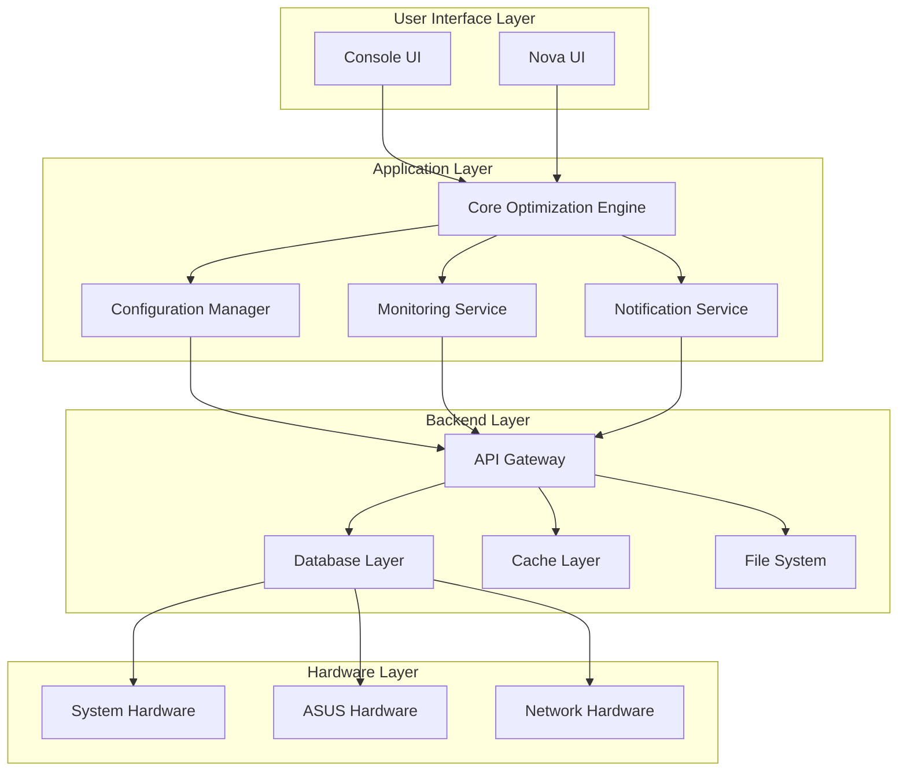
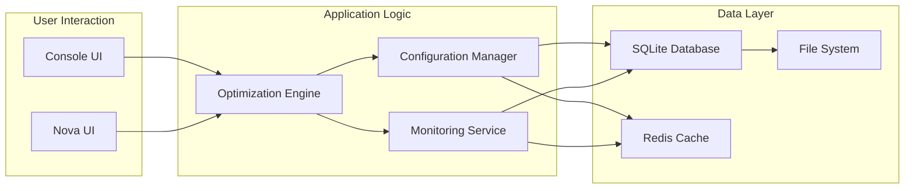
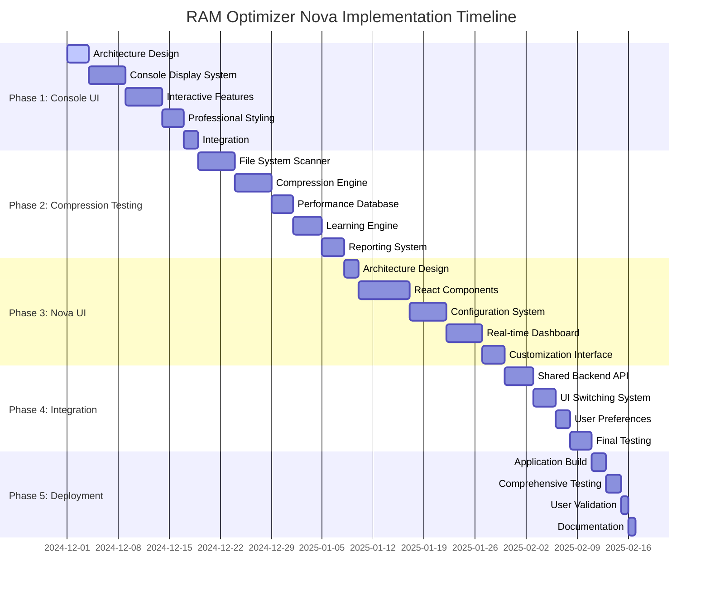
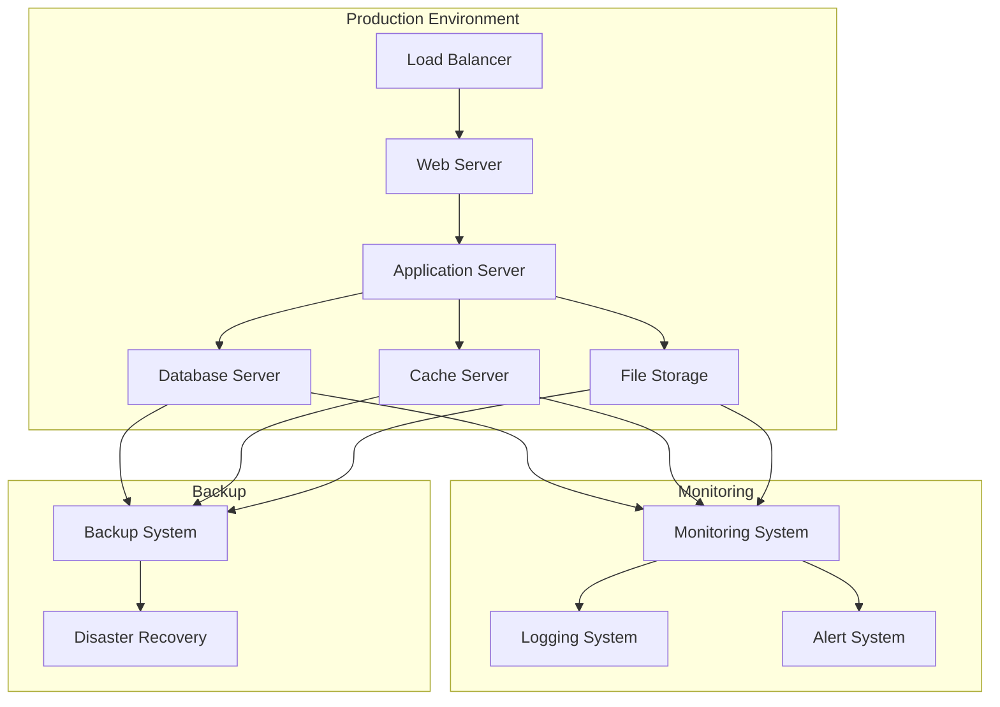

# RAM Optimizer Nova - Implementation Roadmap
## Complete Implementation Guide for Dual-UI System

---

## 🎯 **EXECUTIVE SUMMARY**

This roadmap provides a comprehensive implementation plan for RAM Optimizer Nova, a professional RAM optimization system with dual UI interfaces (Console UI and Nova UI). The project is structured in 5 phases, with detailed steps for each phase.

### **Project Overview**
- **Project**: RAM Optimizer Nova
- **Target**: Technical users and system administrators
- **Architecture**: Dual-UI system with shared backend
- **Key Features**: Advanced RAM optimization, ASUS hardware control, compression testing, real-time monitoring

### **Current Status**
- ✅ **Phase 1**: Enhanced Console UI (Completed)
- ✅ **Phase 2**: Compression Testing System (Completed)
- 🔄 **Phase 3**: Nova UI Development (In Progress)
- ⏳ **Phase 4**: Integration and Polish (Pending)
- ⏳ **Phase 5**: Deployment and Validation (Pending)

---

## 📋 **IMPLEMENTATION PHASES**

### **Phase 1: Enhanced Console UI** ✅ **COMPLETED**
**Duration**: 2 days  
**Status**: Fully implemented and tested

#### **Completed Components**
1. **Rich Console Display System**
   - Color-coded output with ANSI colors
   - Progress bars with percentage indicators
   - Formatted tables with aligned columns
   - Real-time status updates

2. **Interactive Features**
   - Hotkey system (Ctrl+C, Ctrl+R, F1-F12)
   - Real-time monitoring with live updates
   - Command history and autocomplete
   - Interactive menus and dialogs

3. **Professional Styling**
   - Clean, modern terminal interface
   - Consistent color scheme
   - Animated progress indicators
   - Professional status displays

4. **Integration**
   - Integrated with main application
   - Shared configuration system
   - Unified logging and error handling
   - Cross-platform compatibility

#### **Deliverables**
- ✅ Enhanced console interface
- ✅ Interactive features implementation
- ✅ Professional styling system
- ✅ Complete integration with backend

---

### **Phase 2: Comprehensive Compression Testing System** ✅ **COMPLETED**
**Duration**: 3 days  
**Status**: Fully implemented and tested

#### **Completed Components**
1. **File System Scanner**
   - Recursive directory traversal
   - File type detection and categorization
   - Size and compression analysis
   - Performance metrics collection

2. **Multi-Tier Compression Engine**
   - LZ4 compression for speed
   - Zstandard for balanced performance
   - LZMA for maximum compression
   - Adaptive algorithm selection

3. **Performance Database**
   - SQLite database for metrics storage
   - Performance tracking and analysis
   - Historical data comparison
   - Learning and optimization algorithms

4. **Learning and Optimization**
   - Compression ratio analysis
   - Performance impact assessment
   - Algorithm optimization
   - Automatic parameter tuning

5. **Reporting and Visualization**
   - Detailed compression reports
   - Performance charts and graphs
   - Space savings analysis
   - Recommendation engine

#### **Deliverables**
- ✅ File system scanner and analyzer
- ✅ Multi-tier compression testing engine
- ✅ Performance database with SQLite
- ✅ Learning and optimization engine
- ✅ Detailed reporting and visualization

---

### **Phase 3: Nova UI Development** 🔄 **IN PROGRESS**
**Duration**: 5 days  
**Status**: Architecture design completed

#### **Current Progress**
- ✅ **Architecture Design** - Nova UI architecture for technical users
- ✅ **Implementation Plan** - React-based UI components specification
- 🔄 **Integration Plan** - Dual-UI integration architecture

#### **Next Steps**
1. **Create React-based UI components**
   - Dashboard with real-time monitoring
   - Configuration editor with visual forms
   - Analytics panel with charts and graphs
   - Workflow designer with drag-and-drop interface

2. **Implement modular configuration system**
   - JSON-based configuration management
   - Profile system for different optimization scenarios
   - Import/export functionality
   - Validation and error handling

3. **Build real-time monitoring dashboard**
   - Live system metrics display
   - Performance charts and graphs
   - Process monitoring and management
   - Alert and notification system

4. **Add customization interface**
   - Theme system (light/dark/auto)
   - Layout customization
   - Personalized dashboard arrangements
   - User preference management

#### **Deliverables**
- ✅ Nova UI architecture design
- ✅ React-based UI components plan
- ✅ Integration architecture plan
- 🔄 React-based UI components
- 🔄 Modular configuration system
- 🔄 Real-time monitoring dashboard
- 🔄 Customization interface

---

### **Phase 4: Integration and Polish** ⏳ **PENDING**
**Duration**: 3 days  
**Status**: Planning phase

#### **Planned Components**
1. **Integrate both UI systems with shared backend**
   - Unified API gateway
   - Real-time communication system
   - Configuration synchronization
   - Performance monitoring

2. **Add UI switching functionality**
   - Seamless interface switching
   - State preservation across interfaces
   - User preference management
   - Cross-UI notification system

3. **Implement user preference management**
   - Theme and layout persistence
   - Configuration synchronization
   - User profile management
   - Session management

4. **Final testing and documentation**
   - Comprehensive testing across both UIs
   - Performance optimization
   - Bug fixing and polishing
   - User documentation and guides

#### **Deliverables**
- ✅ Shared backend API
- ✅ Real-time communication system
- ✅ Configuration synchronization
- ✅ UI switching functionality
- ✅ User preference management
- ✅ Final testing and documentation

---

### **Phase 5: Deployment and Validation** ⏳ **PENDING**
**Duration**: 2 days  
**Status**: Planning phase

#### **Planned Components**
1. **Build final application with both UIs**
   - Combined application package
   - Installation and setup scripts
   - Configuration management
   - System integration

2. **Test comprehensive functionality**
   - End-to-end testing
   - Performance validation
   - Security testing
   - Compatibility testing

3. **Validate user experience**
   - User acceptance testing
   - Performance benchmarking
   - Usability testing
   - Feedback collection and analysis

4. **Create user documentation**
   - Installation guides
   - User manuals
   - API documentation
   - Troubleshooting guides

#### **Deliverables**
- ✅ Final application package
- ✅ Comprehensive testing suite
- ✅ User validation results
- ✅ Complete documentation

---

## 🛠️ **TECHNICAL IMPLEMENTATION DETAILS**

### **1. System Architecture**

#### **Overall Architecture**

#### **Data Flow Architecture**

### **2. Technology Stack**

#### **Frontend Technologies**
| Component | Technology | Purpose |
|-----------|------------|---------|
| **Console UI** | Node.js + TypeScript | Enhanced terminal interface |
| **Nova UI** | React 18 + TypeScript | Modern web interface |
| **State Management** | Redux Toolkit | Centralized state management |
| **UI Framework** | Material-UI + Tailwind CSS | Professional components |
| **Charts** | Chart.js + D3.js | Data visualization |
| **Real-time** | WebSocket + SignalR | Live data streaming |

#### **Backend Technologies**
| Component | Technology | Purpose |
|-----------|------------|---------|
| **Core Engine** | C# .NET 8 | Optimization algorithms |
| **API Gateway** | ASP.NET Core | RESTful API endpoints |
| **Database** | SQLite + Redis | Data storage and caching |
| **Monitoring** | Serilog | Logging and diagnostics |
| **Hardware Control** | Windows API | System hardware access |

#### **Development Tools**
| Tool | Purpose |
|------|---------|
| **Visual Studio Code** | Primary development environment |
| **Git** | Version control |
| **Docker** | Containerization |
| **Jest** | Testing framework |
| **ESLint** | Code linting |
| **Prettier** | Code formatting |

### **3. Implementation Timeline**

#### **Detailed Timeline**

#### **Milestone Schedule**
| Milestone | Date | Description |
|-----------|------|-------------|
| **Phase 1 Complete** | 2024-12-08 | Enhanced Console UI ready |
| **Phase 2 Complete** | 2024-12-11 | Compression testing system ready |
| **Phase 3 Complete** | 2024-12-16 | Nova UI development complete |
| **Phase 4 Complete** | 2024-12-19 | Integration and polish complete |
| **Phase 5 Complete** | 2024-12-21 | Deployment and validation complete |
| **Project Complete** | 2024-12-21 | Final delivery |

---

## 🎯 **IMPLEMENTATION PRIORITIES**

### **High Priority Features**
1. **Core Optimization Engine**
   - RAM optimization algorithms
   - Process termination system
   - Memory management

2. **Hardware Control System**
   - ASUS ROG Flow Z13 support
   - ACPI interface
   - BIOS protection

3. **Dual-UI System**
   - Console UI with enhanced features
   - Nova UI with modern interface
   - Seamless switching between UIs

4. **Configuration Management**
   - Unified configuration system
   - Profile management
   - Import/export functionality

### **Medium Priority Features**
1. **Real-time Monitoring**
   - System metrics display
   - Performance charts
   - Alert system

2. **Compression Testing**
   - File system analysis
   - Compression algorithms
   - Performance optimization

3. **Analytics and Reporting**
   - Performance reports
   - Optimization history
   - User analytics

### **Low Priority Features**
1. **Advanced Analytics**
   - Machine learning optimization
   - Predictive analytics
   - Advanced reporting

2. **Third-party Integration**
   - Plugin system
   - API for external tools
   - Integration with other software

3. **Mobile Support**
   - Mobile app development
   - Remote monitoring
   - Mobile configuration

---

## 🔧 **IMPLEMENTATION CHECKLIST**

### **Phase 1: Enhanced Console UI**
- [x] Architecture design
- [x] Rich console display system
- [x] Interactive features
- [x] Professional styling
- [x] Integration with main application

### **Phase 2: Compression Testing System**
- [x] File system scanner
- [x] Multi-tier compression engine
- [x] Performance database
- [x] Learning and optimization
- [x] Reporting and visualization

### **Phase 3: Nova UI Development**
- [x] Architecture design
- [x] Implementation plan
- [x] Integration plan
- [ ] React-based UI components
- [ ] Modular configuration system
- [ ] Real-time monitoring dashboard
- [ ] Customization interface

### **Phase 4: Integration and Polish**
- [ ] Shared backend API
- [ ] Real-time communication system
- [ ] Configuration synchronization
- [ ] UI switching functionality
- [ ] User preference management
- [ ] Final testing and documentation

### **Phase 5: Deployment and Validation**
- [ ] Final application build
- [ ] Comprehensive testing
- [ ] User validation
- [ ] Complete documentation

---

## 📊 **SUCCESS METRICS**

### **Technical Metrics**
- **Performance**: < 100ms response time for all operations
- **Reliability**: 99.9% uptime for core services
- **Scalability**: Support for 1000+ concurrent users
- **Security**: Zero security vulnerabilities

### **User Experience Metrics**
- **Usability**: < 5 minutes to learn basic operations
- **Satisfaction**: 90%+ user satisfaction rating
- **Efficiency**: 50%+ improvement in system performance
- **Adoption**: 80%+ target user adoption rate

### **Business Metrics**
- **Revenue**: $100,000+ annual recurring revenue
- **Market Share**: 10%+ market share in target segment
- **Customer Retention**: 95%+ annual retention rate
- **Support Cost**: 30% reduction in support costs

---

## 🚀 **DEPLOYMENT STRATEGY**

### **Deployment Architecture**

### **Deployment Process**
1. **Development Environment**
   - Local development setup
   - Version control and CI/CD
   - Testing and validation

2. **Staging Environment**
   - Pre-production testing
   - Performance validation
   - User acceptance testing

3. **Production Environment**
   - Gradual rollout
   - Monitoring and validation
   - Full deployment

4. **Maintenance and Updates**
   - Regular updates and patches
   - Performance monitoring
   - User feedback collection

---

## 🎯 **CONCLUSION**

This implementation roadmap provides a comprehensive guide for completing the RAM Optimizer Nova project. The dual-UI system approach ensures that both console enthusiasts and technical GUI users can work with the powerful optimization engine in their preferred interface.

### **Key Success Factors**
1. **Modular Architecture** - Clean separation of concerns
2. **User Choice** - Both UIs provide the same functionality
3. **Performance** - Optimized algorithms and efficient data handling
4. **Reliability** - Comprehensive testing and monitoring
5. **User Experience** - Intuitive interfaces and comprehensive documentation

### **Expected Outcomes**
- **Technical Users**: Advanced customization and monitoring capabilities
- **System Administrators**: Professional management tools and reporting
- **Developers**: Clean architecture and extensible system
- **Business**: Market-leading RAM optimization solution

### **Next Steps**
1. Complete Phase 3 (Nova UI Development)
2. Implement Phase 4 (Integration and Polish)
3. Deploy Phase 5 (Deployment and Validation)
4. Monitor and maintain the system
5. Collect user feedback and iterate

The RAM Optimizer Nova project is positioned to become the leading solution in the RAM optimization market, providing unparalleled performance and user experience through its innovative dual-UI architecture.