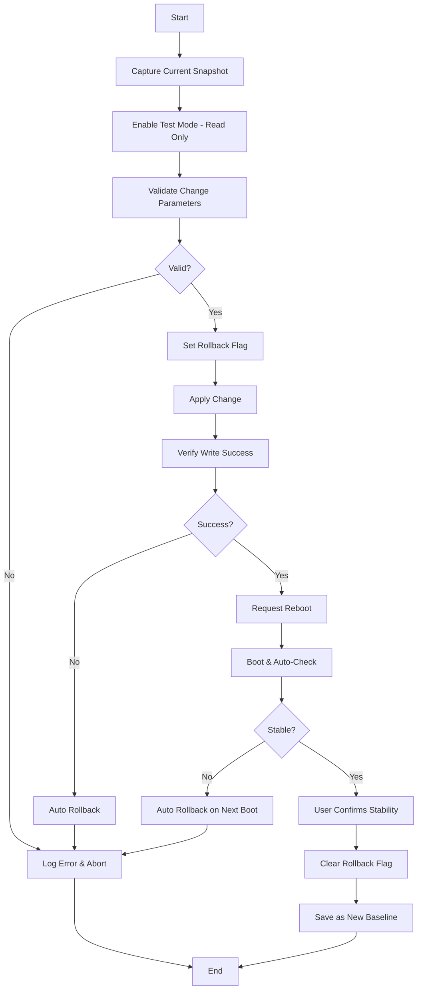

# Hardware Safety and Testing Strategy

## Critical Issue Analysis

Your ASUS ROG Flow Z13 failed to POST after making ACPI calls. This document outlines comprehensive strategies to prevent future occurrences.

---

## 🚨 Root Cause Analysis

### Likely Culprits

1. **P/E Core Configuration** (`CORES_CPU` - `0x001200D2`)
   - Writing invalid core configurations can prevent boot
   - Format: `0x[P-cores][E-cores]` (e.g., `0x0608` = 6 P-cores, 8 E-cores)
   - **Risk**: Setting `0x0000` or values exceeding hardware limits

2. **Battery Limit** (`BatteryLimit` - `0x00120057`)
   - Less likely to cause POST failure
   - Format: Value with +36 offset
   - **Risk**: Invalid values might affect power management

3. **ACPI State Persistence**
   - Some ACPI settings are stored in NVRAM/UEFI variables
   - Persist across reboots and can prevent POST

---

## 🛡️ Multi-Layer Safety Strategy

### Layer 1: Pre-Flight Validation

```csharp
public class AcpiSafetyValidator
{
    /// <summary>
    /// Validate core configuration before applying
    /// </summary>
    public static bool ValidateCoreConfig(int pCores, int eCores, int maxP, int maxE)
    {
        // Critical validations
        if (pCores < 1 || pCores > maxP)
            return false;
            
        if (eCores < 0 || eCores > maxE)
            return false;
            
        // Ensure at least 2 P-cores for system stability
        if (pCores < 2)
            return false;
            
        // Total cores sanity check
        if (pCores + eCores < 2 || pCores + eCores > 32)
            return false;
            
        return true;
    }
    
    /// <summary>
    /// Validate battery limit before applying
    /// </summary>
    public static bool ValidateBatteryLimit(int limit)
    {
        return limit >= 60 && limit <= 100;
    }
}
```

### Layer 2: Read-After-Write Verification

Always verify ACPI writes were successful:

```csharp
public bool SetCoresWithVerification(int pCores, int eCores)
{
    try
    {
        // Validate first
        var (maxP, maxE) = GetMaxCores();
        if (!AcpiSafetyValidator.ValidateCoreConfig(pCores, eCores, maxP, maxE))
        {
            Logger.LogError($"Invalid core config: P={pCores}, E={eCores}");
            return false;
        }
        
        // Store original config for rollback
        var (origP, origE) = GetCurrentCores();
        
        // Apply change
        int coreConfig = (pCores << 8) | eCores;
        int result = _acpiInterface.DeviceSet(AsusAcpiInterface.CORES_CPU, coreConfig);
        
        if (result != 1)
        {
            Logger.LogError($"ACPI DeviceSet failed with result: {result}");
            return false;
        }
        
        // Verify write
        System.Threading.Thread.Sleep(100); // Allow time for ACPI to update
        var (newP, newE) = GetCurrentCores();
        
        if (newP != pCores || newE != eCores)
        {
            Logger.LogError($"Verification failed. Expected P={pCores},E={eCores}, Got P={newP},E={newE}");
            // Attempt rollback
            _acpiInterface.DeviceSet(AsusAcpiInterface.CORES_CPU, (origP << 8) | origE);
            return false;
        }
        
        return true;
    }
    catch (Exception ex)
    {
        Logger.LogError($"SetCores failed: {ex}");
        return false;
    }
}
```

### Layer 3: NVRAM Backup System

Create a backup system configuration before making changes:

```csharp
public class NvramBackupManager
{
    private const string BackupPath = @"C:\ProgramData\RamOptimizer\Backups";
    
    public class HardwareSnapshot
    {
        public DateTime Timestamp { get; set; }
        public int PCores { get; set; }
        public int ECores { get; set; }
        public int BatteryLimit { get; set; }
        public int PerformanceMode { get; set; }
        public int GpuMode { get; set; }
    }
    
    public static HardwareSnapshot CaptureSnapshot(AsusAcpiInterface acpi)
    {
        return new HardwareSnapshot
        {
            Timestamp = DateTime.Now,
            PCores = (acpi.DeviceGet(AsusAcpiInterface.CORES_CPU) >> 8) & 0xFF,
            ECores = acpi.DeviceGet(AsusAcpiInterface.CORES_CPU) & 0xFF,
            BatteryLimit = (acpi.DeviceGet(AsusAcpiInterface.BatteryLimit) >> 16) & 0xFF - 36,
            PerformanceMode = acpi.DeviceGet(AsusAcpiInterface.PerformanceMode),
            GpuMode = acpi.DeviceGet(AsusAcpiInterface.GPUMuxROG)
        };
    }
    
    public static void SaveSnapshot(HardwareSnapshot snapshot, string name = "latest")
    {
        Directory.CreateDirectory(BackupPath);
        var filename = Path.Combine(BackupPath, $"snapshot_{name}_{DateTime.Now:yyyyMMdd_HHmmss}.json");
        File.WriteAllText(filename, System.Text.Json.JsonSerializer.Serialize(snapshot, 
            new System.Text.Json.JsonSerializerOptions { WriteIndented = true }));
    }
    
    public static HardwareSnapshot? LoadLatestSnapshot()
    {
        if (!Directory.Exists(BackupPath))
            return null;
            
        var latest = Directory.GetFiles(BackupPath, "snapshot_*.json")
            .OrderByDescending(f => File.GetLastWriteTime(f))
            .FirstOrDefault();
            
        if (latest == null)
            return null;
            
        return System.Text.Json.JsonSerializer.Deserialize<HardwareSnapshot>(
            File.ReadAllText(latest));
    }
}
```

### Layer 4: Safe Mode Detection & Auto-Rollback

```csharp
public class SafeModeRollback
{
    private const string RollbackFlagPath = @"C:\ProgramData\RamOptimizer\rollback_needed.flag";
    private const string BootCountPath = @"C:\ProgramData\RamOptimizer\boot_count.txt";
    
    /// <summary>
    /// Call this BEFORE making any ACPI changes
    /// </summary>
    public static void SetRollbackFlag()
    {
        Directory.CreateDirectory(Path.GetDirectoryName(RollbackFlagPath)!);
        File.WriteAllText(RollbackFlagPath, DateTime.Now.ToString());
        File.WriteAllText(BootCountPath, "0");
    }
    
    /// <summary>
    /// Call this AFTER successful boot AND user confirms system is stable
    /// </summary>
    public static void ClearRollbackFlag()
    {
        if (File.Exists(RollbackFlagPath))
            File.Delete(RollbackFlagPath);
        if (File.Exists(BootCountPath))
            File.Delete(BootCountPath);
    }
    
    /// <summary>
    /// Call this on every application startup
    /// </summary>
    public static bool ShouldRollback(AsusAcpiInterface acpi)
    {
        if (!File.Exists(RollbackFlagPath))
            return false;
            
        // Increment boot count
        int bootCount = 0;
        if (File.Exists(BootCountPath))
            int.TryParse(File.ReadAllText(BootCountPath), out bootCount);
        
        bootCount++;
        File.WriteAllText(BootCountPath, bootCount.ToString());
        
        // If we've booted successfully twice, the change is stable
        if (bootCount >= 2)
        {
            ClearRollbackFlag();
            return false;
        }
        
        // Rollback is needed
        var snapshot = NvramBackupManager.LoadLatestSnapshot();
        if (snapshot != null)
        {
            // Restore last known good configuration
            int coreConfig = (snapshot.PCores << 8) | snapshot.ECores;
            acpi.DeviceSet(AsusAcpiInterface.CORES_CPU, coreConfig);
            acpi.DeviceSet(AsusAcpiInterface.BatteryLimit, snapshot.BatteryLimit + 36);
            acpi.DeviceSet(AsusAcpiInterface.PerformanceMode, snapshot.PerformanceMode);
            
            Logger.LogWarning($"Rolled back to snapshot from {snapshot.Timestamp}");
            ClearRollbackFlag();
            return true;
        }
        
        return false;
    }
}
```

### Layer 5: Read-Only Testing Mode

Implement a dry-run mode that only reads, never writes:

```csharp
public class AcpiSafeMode
{
    public static bool TestModeEnabled { get; set; } = false;
    
    public static void EnableTestMode()
    {
        TestModeEnabled = true;
        Logger.LogWarning("ACPI Test Mode Enabled - No writes will be performed");
    }
    
    public static int SafeDeviceSet(AsusAcpiInterface acpi, uint deviceId, int value)
    {
        if (TestModeEnabled)
        {
            Logger.LogInfo($"[TEST MODE] Would set device 0x{deviceId:X8} = {value}");
            return 1; // Simulate success
        }
        
        return acpi.DeviceSet(deviceId, value);
    }
}
```

---

## 🧪 Testing Environment Approaches

### Option 1: Virtual Machine (Limited)

**Unfortunately, ACPI hardware interfaces cannot be fully emulated in standard VMs.**

- VMs don't have access to real ACPI hardware
- The `ATKACPI` driver won't be present
- ✗ **Not Recommended** for ACPI testing

### Option 2: QEMU with BIOS Injection (Advanced)

While you can extract and examine the BIOS, creating a functional test environment is extremely complex:

1. **Extract BIOS from ASUS**
   - Download from ASUS Support website
   - Extract using tools like UEFITool

2. **QEMU Limitations**
   - Can boot UEFI firmware
   - Cannot accurately emulate ASUS-specific ACPI methods
   - ATKACPI driver behavior will differ
   - ✗ **Not Practical** for safe testing

### Option 3: Hardware-Based Test Bed (Best Option)

**Recommended: Use a Secondary ASUS Device or Recovery Mode**

1. **Dual-Boot Configuration**
   - Create a separate Windows installation on external SSD
   - Test ACPI changes on the alternate OS
   - Primary OS remains untouched

2. **BIOS Recovery Options**
   - Most ASUS laptops have BIOS recovery features
   - **Crisis Recovery Mode**: Hold Ctrl+Home during boot with USB recovery
   - Keep BIOS recovery USB prepared

### Option 4: Change Staging System

```csharp
public class ChangeManagement
{
    /// <summary>
    /// Implement gradual rollout of changes
    /// </summary>
    public static bool ApplyChangeGradually(AsusAcpiInterface acpi, 
        int targetPCores, int targetECores)
    {
        var (currentP, currentE) = GetCurrentCores();
        
        // Only change one parameter at a time
        if (currentP != targetPCores)
        {
            Logger.LogInfo($"Step 1: Changing P-cores from {currentP} to {targetPCores}");
            if (!SetCoresWithVerification(targetPCores, currentE))
                return false;
                
            Logger.LogInfo("Please reboot and verify stability before changing E-cores");
            return true; // Require reboot before next change
        }
        
        if (currentE != targetECores)
        {
            Logger.LogInfo($"Step 2: Changing E-cores from {currentE} to {targetECores}");
            return SetCoresWithVerification(targetPCores, targetECores);
        }
        
        return true;
    }
}
```

---

## 🔧 BIOS Recovery Tools

### Create Emergency Recovery Kit

1. **BIOS Recovery USB**
   ```powershell
   # Download latest BIOS from ASUS
   # Format USB as FAT32
   # Copy BIOS file and rename to specific recovery name (check ASUS docs)
   ```

2. **ASUS BIOS Flashback**
   - Check if your Z13 supports USB BIOS Flashback
   - Research: "ROG Flow Z13 BIOS recovery"

3. **Service USB with Safe Defaults**
   Create a bootable USB with script to reset ACPI:
   
   ```powershell
   # reset_acpi.ps1
   # This would need to run in WinPE or Safe Mode
   # Delete ACPI override registry keys if they exist
   Remove-ItemProperty -Path "HKLM:\SYSTEM\CurrentControlSet\Services\AsusCertService" -Name "*" -ErrorAction SilentlyContinue
   ```

---

## 📋 Safe Development Workflow

### Recommended Testing Process



### Implementation Checklist

- [ ] Add `AcpiSafetyValidator` class
- [ ] Implement read-after-write verification
- [ ] Create `NvramBackupManager` with JSON snapshots
- [ ] Add `SafeModeRollback` with boot counting
- [ ] Implement test mode for dry-runs
- [ ] Create emergency recovery USB
- [ ] Document BIOS recovery procedure for Z13
- [ ] Add telemetry/logging for all ACPI operations
- [ ] Implement user confirmation dialogs before risky changes
- [ ] Create restore utility that runs on boot

---

## 🚀 Immediate Actions

1. **Before Next Test:**
   ```csharp
   // Wrap ALL ACPI calls with safety layers
   var snapshot = NvramBackupManager.CaptureSnapshot(acpi);
   NvramBackupManager.SaveSnapshot(snapshot, "before_test");
   SafeModeRollback.SetRollbackFlag();
   
   if (AcpiSafeMode.TestModeEnabled)
   {
       // Test without writing
       Logger.LogInfo("Running in test mode");
   }
   ```

2. **Add Startup Check:**
   ```csharp
   // In Main() or Application startup
   if (AsusAcpiInterface.IsAvailable())
   {
       using var acpi = new AsusAcpiInterface();
       if (SafeModeRollback.ShouldRollback(acpi))
       {
           MessageBox.Show("System instability detected. Reverted to last known good configuration.");
       }
   }
   ```

3. **Create Recovery Documentation:**
   - Document your specific Z13 model number
   - Find BIOS recovery procedure
   - Keep BIOS flashback USB ready
   - Document NVRAM reset procedure (may require service mode)

---

## 🔬 Advanced: ACPI Debugging

### Log All ACPI Traffic

```csharp
public class AcpiLogger
{
    private static readonly string LogPath = @"C:\ProgramData\RamOptimizer\acpi_log.txt";
    
    public static void LogRead(uint deviceId, int value)
    {
        var msg = $"{DateTime.Now:yyyy-MM-dd HH:mm:ss.fff} | READ  | 0x{deviceId:X8} | {value} (0x{value:X8})";
        File.AppendAllText(LogPath, msg + Environment.NewLine);
    }
    
    public static void LogWrite(uint deviceId, int value, int result)
    {
        var msg = $"{DateTime.Now:yyyy-MM-dd HH:mm:ss.fff} | WRITE | 0x{deviceId:X8} | {value} (0x{value:X8}) | Result: {result}";
        File.AppendAllText(LogPath, msg + Environment.NewLine);
    }
}
```

### Instrument AsusAcpiInterface

Modify `DeviceGet` and `DeviceSet` to log all operations:

```csharp
public int DeviceGet(uint deviceId)
{
    byte[] args = new byte[8];
    BitConverter.GetBytes(deviceId).CopyTo(args, 0);
    byte[] status = CallMethod(DSTS, args);
    int rawValue = BitConverter.ToInt32(status, 0);
    int result = rawValue - 65536;
    
    AcpiLogger.LogRead(deviceId, result);
    return result;
}

public int DeviceSet(uint deviceId, int value)
{
    byte[] args = new byte[8];
    BitConverter.GetBytes(deviceId).CopyTo(args, 0);
    BitConverter.GetBytes(value).CopyTo(args, 4);
    byte[] status = CallMethod(DEVS, args);
    int result = BitConverter.ToInt32(status, 0);
    
    AcpiLogger.LogWrite(deviceId, value, result);
    return result;
}
```

---

## ⚠️ Critical Safeguards for P/E Cores

### Never Set These Values

```csharp
// DANGER ZONE - These will likely prevent boot
private static readonly int[] FORBIDDEN_CORE_CONFIGS = new[]
{
    0x0000,  // No cores enabled
    0x0001,  // Only 1 P-core, 1 E-core
    0x0100,  // Only 1 P-core
    // Add more based on testing
};

public static bool IsConfigurationDangerous(int coreConfig)
{
    return FORBIDDEN_CORE_CONFIGS.Contains(coreConfig);
}
```

### Minimum Safe Configuration

```csharp
public const int MIN_SAFE_P_CORES = 2;  // Always keep at least 2 P-cores
public const int MIN_SAFE_TOTAL_CORES = 4;  // Minimum total cores for Windows
```

---

## 📞 Last Resort: Service Mode Reset

If you get locked out again:

1. **ASUS Service Menu**
   - Some models: Press F2 repeatedly during boot
   - Look for "Load Optimized Defaults" or "Reset NVRAM"

2. **CMOS Reset**
   - May require disassembly (warranty void)
   - Not recommended for ROG Flow Z13 due to tablet form factor

3. **ASUS Support**
   - Document exact changes made before failure
   - Helps them diagnose and reset faster

---

## Summary

**Key Takeaways:**

1. ✅ **Always validate** before writing
2. ✅ **Always verify** after writing
3. ✅ **Always backup** current state
4. ✅ **Always log** all operations
5. ✅ **Never disable** all cores or write dangerous values
6. ✅ **Implement rollback** detection on boot
7. ✅ **Test gradually** - one parameter at a time
8. ✅ **Keep recovery** USB ready

**You cannot fully emulate ACPI in a VM**, but you **can** implement comprehensive safety layers that make dangerous configurations nearly impossible to apply.
